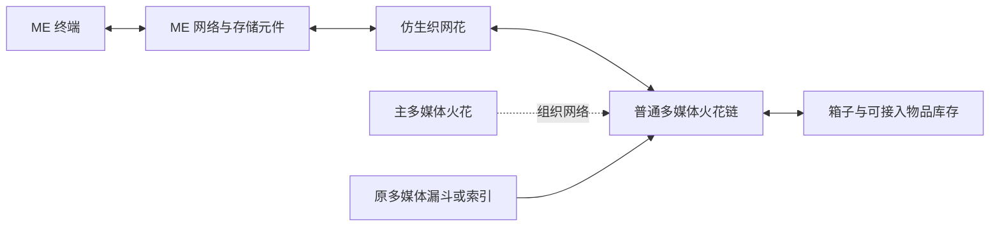

# 仿生织网花：多媒体火花与 ME

仿生织网花让 **ME 终端存取多媒体网络的物品库存**，也让 **多媒体索引、漏斗等装置从 ME 取物**。它由 ME 网络供电，占用一个通道，待机 4 AE/t，无需再接 FE 电缆。

适配 AE2 19.2.17／Minecraft 1.21.1；AE2 需要 GuideME 21.1.1。两者都是可选功能的运行依赖，未安装时不影响其余花、机器和词典。来源及校验值见 [ae2-compat.json](ae2-compat.json)。

## 安装

1. 用机械花药台制作仿生织网花。材料包括普通多媒体火花、漏斗花、花瓣、源质钢和 AE 控制部件；每批 1,000 mB 水、36,000 FE、240 tick。实际配方可在原植物魔法词典或 JEI 中查看。
2. 放在 ME 电缆或普通承托上，使花与 ME 电缆／设备相邻。ME 网络需要供电和空闲通道。
3. 在花和物品箱上安装 **普通多媒体火花**，另放一个主多媒体火花。它们沿用原染色和各轴 8 格连接规则，可以串接；主火花下方不计为库存节点。
4. 空手右键花查看两侧数量、状态，并选择双向、仅 ME 访问或仅多媒体访问。默认双向；配置仅所有者可修改。
5. 手持原植物魔法词典右键花可直达说明。魔力火花负责魔力，多媒体火花负责物品，请勿混用。

## 实际行为

- 不搬一份库存到花里。所有物品仍在原箱子、机器或 ME 存储中；花没有第二套仓库或未说明的物品队列；合成任务只保存 AE 链接。
- ME 与多媒体两向合计默认最多转移 2,048 件/t，可用服务器 `corporeaItemsPerTick` 调整。查询／模拟不扣物品，也不占用转移额度。AE 插入优先补充已有的同类、同组件物品堆叠。
- 多媒体从 ME 取物使用 ME 的正常电力结算；ME 端读写则遵循调用终端／设备的 AE 行为，不再额外扣一次魔力或 FE。
- 默认双向。仅 ME 模式下，多媒体装置不会看到 ME 物品；仅多媒体模式下，ME 不再挂载本网络的物理库存。红石信号或暂停停止访问。
- 一组多媒体网络只允许一朵活动接入花；重复接入会提示并只让确定的一朵生效。不同颜色的独立多媒体网络可接到同一个 ME 网络，彼此仍能经 ME 访问物品。
- 从多媒体读取 ME 时，排除原请求网络在 ME 上的挂载；不排除其他独立多媒体网络。这样既能跨网络取料，也不会把同一箱子算两次。
- 同一物理库存不要再通过存储总线接到同一个 ME 网络；检测到这类重复入口会停用并提示。双箱只装一枚普通多媒体火花，避免原多媒体网络自身的重复统计。
- 普通库存沿用多媒体物品能力查询方向，保留物品提取／插入限制。创造火花、其他 ME 网络视图、特殊非库存节点不冒充物理库存。
- 暂限物品；不接流体、魔力或所有第三方虚拟库存。ME 端是直接库存访问，不替代多媒体拦截器的原请求流程；多媒体端仍由原漏斗／索引发起请求。
- 默认最多 128 个普通多媒体节点、8,192 个物理库存槽。所需区块未加载、无主火花、无电或无通道时停止，不主动加载区块。
- 世界保存连接数据；拆装只保存花的拥有者、暂停、模式、筛选和自动合成开关，重新创建 ME 节点。ME 中的物品不会复制进花的掉落物。

仿生织网花复用保留的共鸣花造型，原共鸣花模型、贴图、原稿和旧存档兼容仍在，不修改或删除这些素材。

## 样品筛选

空手打开花，先点下方快捷栏中的物品，再点上方九个样品格之一；右键样品格清除。样品只记录描述，不拿走或产出物品。需要的样品可先放进快捷栏。

- 全部：不限制；仅样品：只开放匹配物品；排除样品：拒绝匹配物品。空的“仅样品”列表不开放任何物品。
- 默认匹配完整物品组件，包括名字等；切换“仅匹配种类”可忽略这些差异。
- 筛选同时约束两向桥接的展示、计数、模拟和真实插入／提取。不改变原箱子的库存，也不限制同组多媒体装置直接读取本组箱子。

## 缺货合成

默认关闭，在界面打开“合成”后，原多媒体请求全部处理完毕仍缺货才下单；查询和模拟不会下单。需要同一 ME 网络有对应样板、材料、可用 CPU。已有库存因带宽暂时无法取出时，不当成缺货补造；名称匹配多个可合成结果时要求更精确的请求。

每朵花最多四项任务，同时只计算一项计划，每项最多 4,096 件。至少间隔 20 tick 才尝试新计划，同一物品的计算和已接受任务不会因反复红石请求而重复下单。不满额的较大请求可在上一项结束后再次触发。

**成品回到 ME，随后再次请求取货。** 一次漏斗／索引操作不会挂起等合成；自动线可按原方式配合多媒体拦截器、保持器记住缺额，并用红石重试。保持器选择“只保留缺额”，防止重取已交付部分。

- 关闭自动合成停止新下单并取消未接受的计算，已付款任务继续向 ME 交货。
- 暂停、红石禁止、断电、断网或库存满时保留已接受任务，恢复后交货；可在 AE CPU 界面取消。
- 世界重载恢复同一 AE 合成链接，不能靠重载重新下单。拆除花会取消任务，由 AE 原系统退还 CPU 中可退的材料；已经送到外部加工机的材料仍在那里。
- 拆装物品只保留设置，不复制节点身份、合成链接或库存。未安装 AE 的存档仍保留世界中的原连接数据。

## JEI 填充

机械花药台及灌注、符文、纯净、泰拉、酿造和精灵贸易设备支持原 JEI 分类的加号。点击填一批，Shift 加号按首批物品组件尽量填多批；从玩家背包和机内现有材料取料，旧材料退回背包。空间或材料不足时整次取消。

终结材料、催化物、空瓶放进对应额外槽；水、电、魔力与原多方块结构仍需正常提供。配方锁定随填充更新，精灵门沿用原匹配。随机矿物、世界函数、特殊贸易等未支持配方不能借加号绕过限制。

后续候选保留库存节点定位诊断；本版没有新增网络选择、权限分组或虚拟仓库。

## 验证

带 AE2 的 30 项服务端 GameTest 覆盖真实 ME 电缆、存储元件、多媒体主／普通火花、物品框及红石触发的多媒体漏斗、双向数量、组件、模拟、模式、不同多媒体网络、重复桥与重复存储总线、缓存句柄失效。无 AE2 的 24 项测试还确认运行时没有 AE 类，并保留本花存档与拆装设置。新增测试覆盖样品完整组件、真实合成 CPU 与加工样板、同一链接重载和原请求再次取货，以及 JEI 分槽、模拟和背包满的整体回滚。

客户端词典排版和游戏内视觉仍由玩家验收，没有自动启动游戏客户端。
