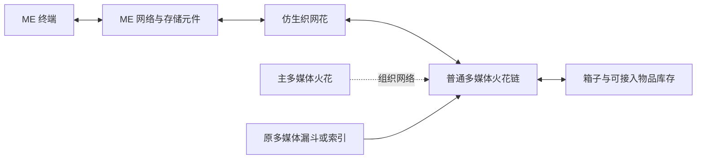

# 仿生织网花：多媒体火花与 ME

仿生织网花让 **ME 终端存取多媒体网络的物品库存**，也让 **多媒体索引、漏斗等装置从 ME 取物**。它由 ME 网络供电，占用一个通道，待机 4 AE/t，无需再接 FE 电缆。

适配 AE2 19.2.17／Minecraft 1.21.1；AE2 需要 GuideME 21.1.1。两者都是可选功能的运行依赖，未安装时不影响其余花、机器和词典。来源及校验值见 [ae2-compat.json](ae2-compat.json)。

## 安装

1. 用机械花药台制作仿生织网花。材料包括普通多媒体火花、漏斗花、花瓣、源质钢和 AE 控制部件；每批 1,000 mB 水、36,000 FE、240 tick。实际配方可在原植物魔法词典或 JEI 中查看。
2. 放在 ME 电缆或普通承托上，使花与 ME 电缆／设备相邻。ME 网络需要供电和空闲通道。
3. 在花和物品箱上安装 **普通多媒体火花**，另放一个主多媒体火花。它们沿用原染色和各轴 8 格连接规则，可以串接；主火花下方不计为库存节点。
4. 空手右键花查看两侧数量、状态，并选择双向、仅 ME 访问或仅多媒体访问。默认双向；配置仅所有者可修改。
5. 手持原植物魔法词典右键花可直达说明。魔力火花负责魔力，多媒体火花负责物品，请勿混用。

## 实际行为

- 不搬一份库存到花里。所有物品仍在原箱子、机器或 ME 存储中；花没有第二套仓库或未说明的物品队列。
- ME 与多媒体两向合计默认最多转移 2,048 件/t，可用服务器 `corporeaItemsPerTick` 调整。查询／模拟不扣物品，也不占用转移额度。AE 插入优先补充已有的同类、同组件物品堆叠。
- 多媒体从 ME 取物使用 ME 的正常电力结算；ME 端读写则遵循调用终端／设备的 AE 行为，不再额外扣一次魔力或 FE。
- 默认双向。仅 ME 模式下，多媒体装置不会看到 ME 物品；仅多媒体模式下，ME 不再挂载本网络的物理库存。红石信号或暂停停止访问。
- 一组多媒体网络只允许一朵活动接入花；重复接入会提示并只让确定的一朵生效。不同颜色的独立多媒体网络可接到同一个 ME 网络，彼此仍能经 ME 访问物品。
- 从多媒体读取 ME 时，排除原请求网络在 ME 上的挂载；不排除其他独立多媒体网络。这样既能跨网络取料，也不会把同一箱子算两次。
- 同一物理库存不要再通过存储总线接到同一个 ME 网络；检测到这类重复入口会停用并提示。双箱只装一枚普通多媒体火花，避免原多媒体网络自身的重复统计。
- 普通库存沿用多媒体物品能力查询方向，保留物品提取／插入限制。创造火花、其他 ME 网络视图、特殊非库存节点不冒充物理库存。
- 暂限物品；不接流体、魔力、自动合成下单或所有第三方虚拟库存。ME 端是直接库存访问，不替代多媒体拦截器的原请求流程；多媒体端仍由原漏斗／索引发起请求。
- 默认最多 128 个普通多媒体节点、8,192 个物理库存槽。所需区块未加载、无主火花、无电或无通道时停止，不主动加载区块。
- 世界保存连接数据；拆装只保存花的拥有者、暂停和模式，重新创建 ME 节点。ME 中的物品不会复制进花的掉落物。

仿生织网花复用保留的共鸣花造型，原共鸣花模型、贴图、原稿和旧存档兼容仍在，不修改或删除这些素材。

## 下一步扩展候选

| 优先方向 | 玩家收益 | 实现边界 |
| --- | --- | --- |
| 样品筛选与分区 | 只把指定物品开放给一侧网络 | 使用样品／标签筛选，保留组件匹配；筛选必须同步影响展示、模拟和实际转移 |
| 缺货自动合成 | 多媒体请求缺货时向 AE 提交生产任务 | 接原保持器或请求流程，保存 AE 合成链接；限并发、合并重复请求，重载不能重新下单 |
| JEI 一键填充已有加工机 | 减少 16 格材料和独立终结槽的手工配置 | 复用现有 JEI 分类，使用同一服务器配方支持判断，不填入带世界函数等不支持的配方 |
| 诊断增强 | 快速找到断开的库存节点和重复入口 | 在现有小界面显示定位信息；不再建另一套网络选取和权限系统 |

现有 ME 终端和库存监控功能已能看到挂载后的物品，应优先使用 AE 原有能力。以上候选尚未实现，不把“缺货会自动合成”当成本版行为。

## 验证

带 AE2 的 26 项服务端 GameTest 覆盖真实 ME 电缆、存储元件、多媒体主／普通火花、物品框及红石触发的多媒体漏斗、双向数量、组件、模拟、模式、不同多媒体网络、重复桥与重复存储总线、缓存句柄失效。无 AE2 的 22 项测试还确认运行时没有 AE 类，并保留本花存档与拆装设置。

客户端词典排版和游戏内视觉仍由玩家验收，没有自动启动游戏客户端。
