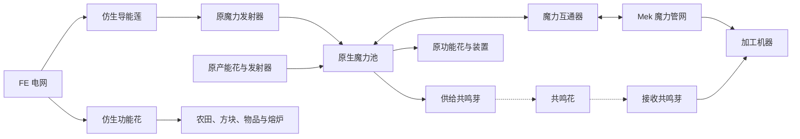

# Botania × Mekanism 设计提案

研究日期：2026-09-12。目标：[Botania `1.21.1-porting`](https://github.com/VazkiiMods/Botania/tree/d617ef057edf7a4b4fb6c6ee6045c973a80bfb05)。

**实现状态：0.1.0-alpha.6 已接入 P1–P3 主线**：两种资源辅助设备、十种加工／控制设备、导能莲、六种仿生功能花，以及共鸣花／芽和机器端点。可用功能、支持范围及实际参数见 [README](README.md)。本文保留原提案和后续候选，主线原型不代表所有第三方配方或客户端视觉已经验收。

**已确定：由一款专用仿生产能花将 FE 转为魔力，不使用 Mek 机器产魔力；保留原生魔力互通和仿生功能花，并设计魔力无线网络。专用产能花采用原创花形，可加入科技元素；已有功能花的仿生版本保留对应原模型。所有仿生花均不要求种在草地或泥土上。** 导能莲与安装方向已获用户认可，原型仍需检验数值。无线方案详见 [WIRELESS.md](WIRELESS.md)，其中基础距离和费用已实现。所有上游事实的源码入口见 [UPSTREAM.md](UPSTREAM.md)。

## 1. 总体方向

将扩展分成三条可以分别交付的产品线：

| 产品线 | 玩家得到什么 | 与 Botania 的关系 |
| --- | --- | --- |
| 魔力网络 | 专用仿生花接 FE 产魔力，经原发射器与池汇集，再接 Mek 管道或共鸣无线网络 | 原产能花、发射器、魔力池和火花仍可使用；互通器与无线节点仅转移资源 |
| 加工机器 | 稳定供料、配方选择、自动取出、断电保存进度 | 读取实际配方与成本，保留催化物、容器和阶段材料 |
| 仿生花 | 一款原创花形产能花，另有原花造型的功能花；均可安装在普通支撑或供电部件上 | 原功能花行为优先复用，产能花接入原产能花网络 |

先覆盖生产与资源，再扩展世界交互。普通装备合成、饰品、法杖和红石工具沿用原有系统；不为每个物品复制一台机器。盖亚战斗、遗物归属和玩家成就保留独立评审，避免用普通配方替代原来的世界过程。

## 2. 版本与实施门槛

用户指定移植分支，研究 SHA 为 `d617ef057edf7a4b4fb6c6ee6045c973a80bfb05`，该提交日期为 2026-09-08。官方发布渠道当前列出的是 1.20.1-455，不能把它用于本项目的 1.21.1 编译。分支源码声明的 build number 456 也不等于已经取得正式的 1.21.1-456 发布 JAR。

| 项目 | 设计基线 |
| --- | --- |
| Minecraft／Java | 1.21.1／21 |
| 本仓库 NeoForge／Mekanism | 21.1.241／1.21.1-10.7.19.85 |
| 上游分支 NeoForge | 21.1.229，源码依赖声明下限；241 已通过固定构建服务端验证 |
| 上游 Patchouli／Curios | 1.21.1-92-NEOFORGE／9.5.1+1.21.1 |
| 上游／本机 JEI | 上游声明 19.27.0.340；本机适配验证 19.22.1.316 |
| 发布来源 | 开发前构建或取得固定 SHA 对应 JAR，记录校验值和必要依赖 |

P0 的固定依赖组合现已通过原型的编译与服务端检查，记录在 upstream-lock.json。之后升级 Botania 时仍以提交为单位复核接口，不跟随浮动分支静默更新；不能将本次结果外推到未经验证的新快照。

## 3. 魔力网络与能耗

### 3.1 三种资源之间的关系

建议将可通过 Mek 管道运输的魔力注册为本扩展 Chemical，**1 单位对应 1 Botania 魔力**。这只是管网表示，不给原魔力池增加第二份库存。

- 加工机器：一份 Chemical 魔力库存，供本机加工消耗。
- 魔力互通器：一份 Chemical 缓存，按模式与相邻原池转移；原池仍保存自己的魔力。
- 专用产能花：FE 储能与一份原生魔力缓存，向绑定的原发射器送魔力；不同时提供 Chemical 输出，避免两套出料路径。
- 仿生功能花：FE 储能与原花内部已付费魔力缓存，后者只供该花工作，不能抽出到外部管网。
- 无线网络：源池与接收机仍保存各自实际魔力；共鸣花和共鸣芽没有影子库存或全网魔力账户，接收机与有线管道共用同一份 Chemical 容器。
- 原生火花与发射器首先通过原魔力池接入。首版不同时把每一台加工机器注册成原生魔力池，避免所有绑定、火花升级和物品充魔语义一并进入首版范围。

### 3.2 专用产能花：仿生导能莲（暂名）

这是新增的一个花种，可以种植多株。它通过根部或侧面接收 FE，将电能转为原生魔力，用森林法杖绑定魔力发射器。生产线为 **电缆 → 导能莲 → 原发射器 → 原池 → 互通器 → Mek 管网**。不再注册或保留任何 FE 产魔力的 Mek 发生器。

#### 外观与安装

花冠、茎和叶子构成完整花形，模型保持透空。建议花瓣以浅青或蓝白为主，叶片保留绿色，花蕊和少量叶脉使用银灰导线纹；工作时只让花蕊与叶脉局部发亮。科技感来自花自身的细节，不用机箱、工业花盆或完整金属方块代替花体。

这是用户新授权的原创花形，后续单独制作模型与真正的 16×16 材质。六种仿生功能花继续引用原花模型。根部可以安装在石块、玻璃、机壳和能承托花的 FE 电缆／供电部件上，不需要泥土、草地或耕地；安装规则见 5.2。

#### 建议首版数值

| 参数 | 建议值 | 作用 |
| --- | ---: | --- |
| 电能成本 | 50 FE／魔力 | 原生回流的最大理论电量为输入的 20% |
| 单株产率 | 4 魔力／游戏 tick，即 80／秒 | 固定吞吐，不能一株承担整个后期工厂 |
| 满速输入 | 200 FE／tick | 产率提高必须同步增加电力消耗 |
| FE 缓存 | 20,000 FE | 满速约 5 秒缓冲 |
| 魔力缓存 | 800 魔力 | 约 10 秒产量，不承担长期储存 |
| 升级 | 首版不接 Mek 速度／能量升级 | 扩容依靠更多花与合适的发射器；后续升级另核算 |

这些是待实测的平衡初稿。原生火红莲在持续燃烧期间每两 tick 产 3 魔力，平均 1.5／tick，另有燃料与冷却。导能莲约相当于 2.7 株处于燃烧阶段的火红莲，优势是稳定电供，代价是更晚的合成门槛、持续用电和阵列占地。不能只按瞬时峰值比较彼方兰、炽玫瑰等有特殊投入或冷却的花。[火红莲源码](https://github.com/VazkiiMods/Botania/blob/d617ef057edf7a4b4fb6c6ee6045c973a80bfb05/Xplat/src/main/java/vazkii/botania/common/block/block_entity/flower/generating/EndoflameBlockEntity.java)

原生魔力转换器在 NeoForge 上为 **1 魔力 → 10 FE**，50 FE／魔力时，直接回流最多回收 20%，再考虑传输只会更低。兑换率不接受能量升级折扣，配置也不能低到形成正收益循环。功能花内部 FE 供能采用相同基准，避免换成仿生版便自动获得更便宜的魔力。[转换器源码](https://github.com/VazkiiMods/Botania/blob/d617ef057edf7a4b4fb6c6ee6045c973a80bfb05/Xplat/src/main/java/vazkii/botania/common/block/block_entity/mana/PowerGeneratorBlockEntity.java)

#### 实际产能与停止条件

每次生成量限定为 `min(当游戏 tick 剩余产量额度, FE / 50, 魔力剩余容量)`，只按实际新增魔力扣 FE；不足 50 FE 的余额留在储能中。未绑定、目标区块未加载、发射器满、花缓存满、暂停或红石禁止时停产，已有 FE 与魔力保留。暂停时也停止向外输送，断电不销毁已付费魔力。

优先继承 `GeneratingFlowerBlockEntity`，用一份原生缓存接入 `ManaCollector`；原绑定范围为 6 格，沿用法杖交互。生产额度以世界游戏 tick 计数，不以方法被调用次数计数，防止时间加速或重复 tick 绕过固定产率。以后若开放加速，必须显式调整额度并同步扣电，而非仅多调用一次产能方法。

首版合成建议使用原产能花、元素符文、魔力钻石和 Mek 控制部件，让玩家先完成基础 Botania 供魔与符文阶段。具体配方待评审；不在开局仅凭铜铁就获得无限供魔替代品。

### 3.3 魔力互通器

玩家将它放在原魔力池旁边，用界面选择“从池抽取”或“向池供给”。连接面随朝向换算；默认只访问指定相邻面，切换模式立即改变实际传输方向。管道面与原池连接面分开。

首版支持已经核对过的普通、稀释和华丽魔力池。创造池不进入生存资源守恒路径。第三方池需要单独适配，不能把任何 `ManaReceiver` 当成可正负转移的储罐。

实现时先读双方数量和空间，限定当次转移量，再执行并按实际变化结算。`receiveMana` 没有模拟或返回值，模拟请求只能做只读容量计算；需要从具体池确认负值抽取、容量和身份契约。每次访问核对区块、方块实体、面配置和模式；不能从魔力虚空的 `isFull=false` 推断它能无损接收无限资源。

### 3.4 魔力充能座

给石板、魔力戒指等可存魔物品提供管道自动充放魔：一个待处理槽、一个完成输出槽，支持目标百分比和充入／抽出模式。不能只用物品名称判定，使用当前 `ManaItem.LOOKUP`，遵守物品的接收、抽取和禁止输出标志。

部分物品要求真实池上下文。首版优先做依附相邻原池的充能座；P0 证明上下文契约后再决定是否可由机器本身安全提供池接口。泰拉粉碎者成长、装备修复等特殊行为另列适配，不能承诺所有有魔力相关提示的装备都能充放。

### 3.5 魔力无线网络

详细拓扑、玩家操作、守恒与验收见 [共鸣花网络设计](WIRELESS.md)。暂按同维度基地网络设计：

| 部分 | 建议 |
| --- | --- |
| 部件 | 一株共鸣花管理一个网络；共鸣芽作为供给、接收或中继 |
| 范围 | 每条链路 32 格；每端最多一个中继，源至目标最多 4 跳 |
| 带宽 | 全网 128 魔力／tick，单端 64，中继共享 128；基础最多 16 个非核心节点 |
| 费用 | 每交付 50 魔力、每跳额外消耗 1 魔力；小额累计计费，失败和空闲不收费 |
| 分配 | 供给保留量、接收目标量、高／普通／低优先级按 4∶2∶1 权重轮转 |
| 权限 | 默认私人网络，按服务器 UUID 和授权成员加入；同名同色不等于同一网络 |

常见的供给芽 → 核心 → 接收芽为 2 跳，到货 100 时源扣 104。资源来自已加载原池，送往已核对的池或本扩展机器实际开放的输入面。导能莲继续先入原池；六种仿生功能花仍用 FE，这层网络不输送电能。

核心卸载时网络暂停，中继卸载时对应路径暂停，其他可用路径继续；不强制加载区块，不补发离线流量。共鸣系统不修改原生火花，近距离高吞吐仍可使用原火花。无限距离和跨维度属于后续独立方案。

## 4. 加工机器清单

以下共建议 **10 种加工设备**，另有互通器、充能座两种资源辅助设备，专用导能莲与六种仿生功能花，以及无线网络的共鸣花／共鸣芽。不设置机器式魔力发生器，也不要求一次做完。

| 设备暂名 | 用途与主要输入 | 资源与保留条件 | 推荐批次 |
| --- | --- | --- | --- |
| 机械花药台（已实现） | 花瓣与原配方材料 → 花；独立终结材料槽和水罐 | FE；每批 1,000 mB 水；终结材料取配方 reagent，仿生配方仅供机械台使用 | P1 已实现 |
| 魔力灌注室 | 魔力钢、魔力钻石、魔力珍珠、炼金和复制转化 | FE＋配方魔力；催化槽装原催化方块，保留 | P1 |
| 符文锻造室 | 元素、季节等符文及可适配特殊配方 | FE＋配方魔力；保留 catalysts，消耗 reagent，处理剩余物 | P1 |
| 纯净转化室 | 白雏菊的活木、活石等转化 | FE；白雏菊原配方不额外收魔力；首批仅支持安全的物品化转化 | P1 |
| 泰拉凝聚室 | 魔力钢、魔力珍珠、魔力钻石等 → 凝聚产物 | FE＋配方魔力；保留原 3×3 平台材料要求 | P2 |
| 植物酿造室 | 原植物酿造材料＋对应容器 → 酿造物 | FE＋容器实际要求的魔力；保留容器组件与配方剩余物 | P2 |
| 凝矿室 | 石质原料 → 凝矿兰／炎矿兰对应矿石 | FE＋选中配方成本；使用对应原花作为保留组件，按权重抽样 | P2 |
| 异构石材室 | 原料 → 异构花石材 | FE＋配方魔力；保留生物群系权重，不能任意点选稀有产物 | P2 |
| 精灵贸易控制器 | 自动向真实精灵门交付材料并接收全部交易产物 | 控制器搬运耗 FE；门开启与交易费用仍由原池承担 | P3 |
| 魔力附魔控制器 | 向真实魔力附魔装置供装备和附魔书并取回 | FE 搬运＋原附魔魔力；保留附魔书、有效附魔与原结构规则 | P3 |

独立加工机把物品直接输出到自己的输出槽，支持 Mek 自动弹出。P3 控制器只与紧邻的真实装置关联，一个原装置最多一个控制器；不提供跨区块的远程绑定。

### 4.1 花瓣与符文：材料区按 16 项设计

不能照搬现有扩展的八格或九格材料区：当前花瓣配方已有 16 项材料的例子，符文实现允许材料和催化物合计最多 16 项。机械花药台已采用 4×4 材料区、独立终结材料槽和六格输出；符文设备后续沿用此容量思路。

符文的催化物仍从完整配方输入中匹配，正常生产后留回原槽；不能因为用了高级符文就统一消耗，也不能根据 RuneItem 类型一概保留。调用原 `getRemainingItems` 处理催化物和容器，空间不足时停止。所有参与配方的对象使用副本，实际提交时才消耗。

### 4.2 魔力灌注：保留催化与动态结果

同一台设备处理普通灌注、炼金和复制，由催化槽和配方选择决定。沿用原生“匹配催化配方优先”的顺序；不能因为材料相同就误做普通转化。

调用 `getRecipeOutput` 取得真实结果并保留组件，不调用返回空的通用 `assemble`。首版催化槽仅解释已核对的原催化方块状态；有自定义状态、额外世界依赖或副作用的第三方配方列为待适配，不假装全部支持。

### 4.3 白雏菊：不是普通物品配方

白雏菊 API 接收世界位置和 BlockState，可能调用世界函数。当前原生深板岩转化就带 `pre_update_function`；因此不能把全部配方仅按输入输出做进机器。

首批只接入已确认的纯状态转化，输入与输出必须能安全表示成物品，且无世界回调。水、其他流体、需世界函数或特殊位置检查的配方仍由原白雏菊处理，后续另做真实工作区。界面与 JEI 转移只接受本机已支持的集合。

原花轮流检查八个位置，`getTime()` 是目标被检查的次数；例如活石配方 time=150，对单一位置约为 1,200 游戏 tick，不能误写成 150 tick。机器可以按八路并行与速度升级设计，但必须明确基准吞吐，而不是无意获得八倍速度。[源码与配方](https://github.com/VazkiiMods/Botania/blob/d617ef057edf7a4b4fb6c6ee6045c973a80bfb05/Xplat/src/main/java/vazkii/botania/common/block/block_entity/flower/misc/PureDaisyBlockEntity.java)

### 4.4 泰拉、凝矿与异构：保留阶段和随机规则

泰拉凝聚室在原平台中心工作，读取对应平台标签；投入原材料、整批原魔力成本和本机 FE。原型要证明平台损坏、重载与输出满时资源不会丢失。建议机内进度暂停保存，而非复制原散落物品失效后魔力消散的交互，这属于本扩展明确的体验变化。

凝矿和异构使用当前配方的 `getManaCost()`、`getCooldown()`、位置相关权重及输出方法。按实际原料匹配，不能只按维度名称猜矿表；炎矿条件和 Garden of Glass 条件须按实际配方与原花分别核对。

随机产物在完整提交阶段只抽一次。提交前按候选的最大消耗与产物预留空间，提交后扣实际选中成本。异常中断后以已付费批次恢复，不能让重载、暂停或输出阻塞触发重抽。具体配方带世界回调时采取与白雏菊相同的支持边界。

### 4.5 酿造、精灵贸易与附魔

酿造成本来自 `BrewContainer.getManaCost`，拒绝值不能当零费用。生成结果使用原容器输出方法；植物酿造系统与普通 Minecraft 药水不同，不能直接复用 Ars 的药水罐模型。

精灵门保留真实门框、自然水晶和魔力池。当前分支开启总成本常量为 200,000，单次解析交易为 500，按有效池数量分摊。控制器不能既让门扣费又从机内再扣一次，也不能只收材料而免除开门条件。输出使用 `tryAssemble` 的全部结果与 `matchedInputSlots` 数量；词典升级和原样退回配方单独处理，避免自动循环。

附魔不是独立 RecipeType。附魔书保留、物品是否允许附魔、当前附魔和冲突、世界结构以及上游配置都必须交给对应规则。P3 先验证真实装置控制，不能先复制一份简化公式做出与原装置不同的结果。

## 5. 仿生功能花：原花外观，FE 供能

### 5.1 首批六种

建议先做六种可安装在普通支撑上的功能花，形成可组合的生产线。名称加“仿生”前缀，保留原花轮廓、颜色、模型、贴图和选取形状；安装材料不受原花土壤条件限制。

| 仿生花 | 保留的原用途 | 必须保留的限制 | 建议用途 |
| --- | --- | --- | --- |
| 仿生翡翠苋 | 在合适地面生成随机神秘花 | 需要可生长空间，读取原花标签；不固定指定颜色 | 神秘花与花瓣供给 |
| 仿生粘土花 | 消耗世界中的沙，产生粘土球 | 当前分支一次原操作产 **1 个粘土球**，不是整块粘土 | 接方块放置和收集线 |
| 仿生田园康乃馨 | 加快合适植物的生长尝试 | 原标签、目标判定、随机生长／骨粉逻辑；一次尝试不保证生长成功 | 农业与产能花原料供给 |
| 仿生漏斗花 | 收集掉落物并送入原规则允许的相邻容器 | 物品框筛选、拾取延迟、范围及容器满的处理 | 收集花瓣、粘土与其他世界产物 |
| 仿生手掌花 | 从世界物品放置对应方块 | 原模式、支撑与目标条件、实际物品消耗；不能复制方块 | 自动补沙和补石 |
| 仿生冶炼火 | 给可被原花加热的装置供热并推动烹煮 | 查询 `ExoflameHeatable`，遵循目标可加工条件；不把所有机器强制设为燃烧 | 熔炉组供热 |

原翡翠苋每次生花扣 100 魔力、粘土花扣 80、田园康乃馨每次生长尝试扣 5。在统一建议倍率 50 FE/魔力下，可分别作为 5,000、4,000、250 FE 的工作预算基准；最终以原花实际扣费点结算。漏斗花、手掌花和冶炼火需要额外核对无魔力基础行为及供热／加速差异，不能简单按掉落数量或炉内物品数量计费。

### 5.2 所有仿生花的安装、供电和操作

导能莲和六种仿生功能花都采用安装规则：下方有承托、花所在位置有空间即可，不检查草地、泥土、耕地或土壤标签。石台、木板、玻璃和金属机壳均可使用；Mek 电缆等细部件按根部中央承托及供电连接判断，不要求完整方块顶面。支撑被拆时正常掉落，FE、魔力和原设置随物品保存。首版仍要求支撑，自由悬空属于后续漂浮版本。

FE capability 暴露在仿生花自身的相邻面，优先允许从根部下方直接连接电缆或输出 FE 的设备，侧面也可接线。可以额外做纯布线用基座，但不是必需的土壤替代品；没有基座也可安装。不要首版就引入大范围无线扫描供电。

放宽的是仿生花本身的安装条件。翡翠苋生成的普通神秘花仍需可生长地面，田园康乃馨仍需合适作物，粘土花仍消耗沙。实现时覆写本扩展方块的安装／生存判断，不修改原 Botania 花的全局土壤标签，也不把土壤限制通过继承又带回来。

仿生花沿用森林法杖的原功能设置，FE、暂停状态与工作范围通过简短 HUD 查看。没有配置需求的花不强加整页机器 GUI。可用名称与 HUD 区分仿生版本，不需要重画花瓣或加金属轮廓。

首批不加速度和范围升级，先证明原行为与供电一致；否则同时改变扫描、随机频率和能耗，难以确认基础契约。后续升级放到统一控件或供电基座中，避免每朵花新增一套菜单。

进入原花世界扫描前核对作用区域已加载，缺区块时暂停。首批不启用红线仿制的远端作用，后续适配再核对实际作用位置、供电位置与区块边界；不能让复用原 tick 绕过本仓库的不强制加载要求。

### 5.3 原生行为复用方案

建议新增本扩展的仿生方块／物品，引用原模型，复用相应原花 BlockEntity 类型。上游已有 `BlockEntityTypeAddBlocksEvent.modify` 的用法，可在 P0 验证这些类型接受新增方块。相应红石敏感接口、方块状态属性、功能模式和方块事件必须一起匹配，不能只给新方块挂旧 tick。

供能适配只作用于本扩展注册的仿生方块：

1. FE 按比例充入原花内部的一份魔力缓存，作为已付费工作储备；不再绑定或抽取附近原生池。
2. 原花仍按自身逻辑消耗这份缓存；不额外创建一个隐藏原花，不手动多调用 tick 加速，也不复制各花整段工作代码。
3. FE 与尚未使用的工作储备均保存，拆装时也保留。HUD 可用 FE 等值显示储备，避免扣电后看起来资源消失。
4. 工作储备没有通用魔力输出接口，不能被转换回池或管道。总可用额度不足时停止，尤其防止漏斗花、手掌花回落原生无魔力基础模式。
5. 保留原生按“有效尝试”收费的地方：如田园康乃馨施加一次有效生长尝试，即使植物这次没有长大，也不退款重新抽随机数。

上述路径是待原型验证的实施建议。若原花的构造、掉落或模式耦合使复用不可行，先调整适配边界，不扩大到修改所有原花的全局规则。需要 Mixin 时仅限上述供能和保存入口，并以原始方块作为对照测试。

### 5.4 后续花的取舍

| 候选组 | 后续方向 |
| --- | --- |
| 凝矿兰、炎矿兰、异构花 | 原位改造型候选，保留世界转化；与机内加工的凝矿室形成不同摆放选择 |
| 畜牧花及其他生物作用花 | 单独评估实体事件、食物、冷却和掉落；通过原生行为验收后追加 |
| 其他仿生产能花 | 专用 FE 导能莲已列入首版；火红莲、彼方兰等进一步改造仍保留燃料／食物差异，另行评估用途 |
| 聚宝花 | 保留原生召怪、结构与掉落流程，暂不做“直接抽宝箱物品”的机器 |
| 热爆花、启命英、勿落草等 | 爆炸来源、生命游戏或实体互动是核心玩法，先保留原生系统并给它供料／收集 |
| 漂浮和迷你仿生花 | 第二轮外观兼容；核对漂浮标签、岛屿数据、原尺寸和范围，不在同一个实体上强切地栽／漂浮状态 |

## 6. 进度与平衡

建议按原材料阶段开放机器，而非依赖全局玩家成就。多人服务器上的机器不应因拥有者离线或换人而失效。

| 阶段 | 建议解锁 |
| --- | --- |
| 活木／活石与初始魔力钢 | 互通器、花瓣调合、基础灌注、纯净转化；魔力来自原产能花 |
| 元素符文与基础功能花 | 导能莲、符文锻造、六种仿生功能花、酿造 |
| 首份泰拉钢与精灵材料 | 泰拉凝聚工业化、凝矿／异构、扩充魔力缓存 |
| 完成原生精灵贸易后的网络扩展 | 基础共鸣花网络；原火花、精灵材料和控制部件作为合成基础 |
| 已建设完整精灵门与附魔装置 | 对应物流控制器 |
| 盖亚阶段 | 可选高级吞吐与后续花；不自动产盖亚之魂或解除遗物绑定 |

机器合成使用原装置、对应原花或阶段材料作为一次性成本。仿生花建议用对应原花加控制部件制作，让外观、用途与合成来源一致，不增加无用途的多层中间核心。

下表按每株 4 魔力／tick、50 FE／魔力估算理论生成量，不含发射器传输耗散、阻塞和机器加工时间：

| 原配方例子 | 源码魔力 | 对应电量 | 单株生成时间 | 16 株生成时间 |
| --- | ---: | ---: | ---: | ---: |
| 魔力钢锭 | 3,000 | 150,000 FE | 37.5 秒 | 约 2.3 秒 |
| 魔力珍珠 | 6,000 | 300,000 FE | 75 秒 | 约 4.7 秒 |
| 魔力钻石 | 10,000 | 500,000 FE | 125 秒 | 约 7.8 秒 |
| 泰拉钢锭的凝聚步骤 | 500,000 | 25,000,000 FE | 104 分 10 秒 | 约 6 分 31 秒 |

16 株共需持续 3,200 FE／tick，并需要能承接 64 魔力／tick 的发射器配置。这个规模用于检验“稳定省维护，但仍需电力和阵列投入”的定位；单株不是泰拉钢量产方案。泰拉钢一行不含前三种材料的制备成本。

正式定数前，在相同原阶段材料预算和面积下，对照火红莲、持续供料的彼方兰与导能莲阵列，分别记录实际入池魔力、材料／电力成本和维护量。优先调单株产率与合成门槛，避免仅提高 FE 数值却仍允许一朵花包办所有阶段。普通加工机的能量升级仅作用于机械 FE，不减少配方魔力。

## 7. 界面、物流和保存

花与共鸣网络采用紧凑的半透明深灰界面，以对齐的文字、储量和必要设置为主。用户最终要求进一步简洁：去掉图标装饰、供魔示意图和常驻说明；次要信息使用悬停提示。不添加花瓣、叶片或藤蔓边框／按钮，也不套用 Mek 机器窗口。普通加工机使用简洁的 Mek 基础窗口。材料、终结材料、催化部件和输出按用途分区；花瓣与符文使用宽版材料区，其他设备使用紧凑版。此阶段不冻结像素坐标，避免尚未确定的槽位硬挤进前三个扩展的固定窗口。

- 选择器使用产物图标、本地化名称和搜索；炼金／复制按催化筛选，随机矿表不提供指定结果按钮。
- 物品输入、额外输入、成品输出、Chemical 输入和能量分别进入真实六面配置。默认前／左供料、上方补给、右侧出料，再按具体槽位确认。
- 所有输出、容器及催化物返还在提交前预留；产物直接进唯一输出区。多产物配方不能只保存第一个。
- 暂停、断电、无材料和输出满分别显示原因。已有库存可按设置转移；暂停不要求清空机器。
- 配方、组件、催化、成本与有效工期进入工作签名；补充同类库存不无故清零。配方重载使缓存失效；已付费待输出批次保留。
- 世界库存、拆装组件和菜单同步分别接入；引用原装置的控制器不把原装置库存重复存到自己物品中。
- 导能莲单独制作原创花形模型与 16×16 材质，允许少量科技细节；六种仿生功能花引用原生花模型。普通加工机器直接复用仓库原创 Mek 四面贴图，映射记录在 art/machine-texture-reuse.json。

## 8. JEI 与自动化兼容

上游已有白雏菊、魔力池、花药台、符文祭坛、精灵贸易、植物酿造、泰拉凝聚、凝矿兰、炎矿兰和异构花十类 JEI 页面。机器添加到相应类别的工作设备列表，沿用原版布局，不新增重复分类。

类别显示所有原生配方，并不表示本机能执行所有第三方实现。配方转移和机器选择器必须使用服务端同一份支持判断；世界回调和未适配容器给出明确原因。

仿生花均使用机械花药台专用分类，普通花药台和工作台不能制作。涉及多槽输入与催化物的转移不能忽略额外 reagent；仍需一次真实管道输入、已有堆叠继续补入、满输出停止和恢复的验收。

## 9. 分阶段交付

| 阶段 | 实际内容 | 结束条件 |
| --- | --- | --- |
| P0：验证设计可实现 | 固定 Botania JAR；导能莲 → 原发射器／池 → 互通原型；一种仿生功能花；无线 W0 的资源适配 | 非土壤安装、电魔力守恒、单 tick 产率、原花模型与保存契约明确 |
| P1：基础生产线 | 导能莲、互通器；花瓣、灌注、符文、纯净四种加工机 | 原花可供启动所需魔力；导能莲阵列通过实际入池产量和平衡验证 |
| P2：仿生与进阶加工 | 六种仿生功能花；泰拉、酿造、凝矿、异构；充能座；基础无线网络 W1 | 原生对照、随机与组件保存、循环能量、无线带宽和权限检查通过 |
| P3：原装置控制 | 精灵贸易和魔力附魔控制器 | 真实原结构、付费、权限、满输出和拆装无损；再评估后续花 |

仿生花在 P0 就验证技术路径，避免等全部机器完成后才发现原生模型或保存方式无法接入。P1 与 P2 的排期可以根据该原型结果调整；不预设开发天数或凑固定测试数量。

## 10. 重点验收案例

| 风险 | 最小有效验证 |
| --- | --- |
| 电力循环 | 导能莲 → 原发射器 → 原魔力转换器 → FE 回流，另测经原池／互通器的路径，不能净增电 |
| 产率与堵塞 | 同游戏 tick 重复调用不超 4 魔力；目标满、未绑定或未加载时停产，恢复后不补发停机期间产量 |
| 非土壤安装 | 石、玻璃、机壳和真实 Mek 电缆顶部可安装与供电；移除支撑掉落并保留储能；原 Botania 花安装规则不变 |
| 转换丢失或复制 | 小于一批的池空间、两方向切换、模拟调用、断开及缓存 handler；双方总量变化精确对应 |
| 配方误扣 | 符文 catalysts／reagent、花瓣水与种子、灌注动态组件、酿造实际容器、多产物精灵交易 |
| 世界配方被简化 | 带函数的白雏菊配方不能进入纯物品加工；真实工作区路径另验事件和位置 |
| 随机重抽 | 输出阻塞、暂停、存档重载和拆装后，已付费批次结果不改变 |
| 仿生花偏离原行为 | 同样目标分别给原花魔力和仿生花 FE，对照消耗、范围、模式和产物；普通原花不受适配影响 |
| 断供仍免费工作 | 漏斗花和手掌花用完预算后停机；满箱不吞物品，无可放位置不消耗方块 |
| 多扣或漏扣尝试费 | 田园康乃馨无适用植物时不收费；有效生长尝试按原语义付费，不以随机结果决定退款 |
| 仿生花丢失储备 | FE、内部工作储备、原模式及冷却经世界保存、掉落组件与重新放置保留 |
| 原模型失效 | 方块、物品、cutout、状态属性、资源包覆盖；浮空与小型版本单独验收 |
| 原控制器覆盖库存 | 原装置库存唯一、满输出停止、结构损坏断开、修复恢复；无强制加载区块 |
| 无线网络 | 按 WIRELESS 的 W0／W1 验证费用余量、共享带宽、权限、区块卸载和真实库存；无线与有线共用时不重复记账 |

逻辑按相关范围运行无界面服务器；客户端视觉、布线观感和整合包体验由用户验收。当前方案没有宣称这些案例已经通过。

## 11. 本轮结论与待评审项

建议从 **导能莲供魔网络＋四台基础加工机** 起步，同时验证一种仿生功能花，再扩充其余五种。完整候选为 2 种资源辅助设备、10 种加工／控制设备、1 种专用产能花和 6 种仿生功能花，以及共鸣花／共鸣芽两种无线部件；这是分阶段目录，不是一次性实现承诺。

用户已认可花式产能、花形可带科技元素、非土壤安装与当前平衡方向，并追加无线设计。基础无线范围、节点和费用已落地；导能莲保留 50 FE／魔力、4 魔力／tick。后续仍需玩家实测阵列与原产能花的同阶段平衡，以及客户端布线和视觉体验。

## 12. alpha.6 实现取舍

- P1–P3 主线设备均已注册并接入物流，具体限制以 README 的设备表为准。P0 的固定 JAR 与原型链路已验证；跨维度、高级网络、更多候选花及漂浮／迷你版本仍是后续提案。
- 纯净转化采用每件原 time 的基础工时，等效原花八个位置同时工作；不是单位置加速八倍的宣传口径。带世界回调的纯净／矿物配方继续交给原花。
- 随机矿物机在最终完成时抽取，先按候选最大消耗与空间保守预留；工时采用候选最长冷却，扣实际选中魔力。产物立即进入唯一输出区，不另设付费随机待输出队列。
- 精灵贸易使用真实门的结构、开放阶段和 consumeMana 结算，加工库存属于控制器，门户自己的世界投料仍属于门户；不镜像门户库存。标准配方通过 tryAssemble 返回完整数量，词典／原样退回及特殊实现不进入自动控制器。
- 附魔由真实装置处理装备、附魔规则和费用，控制器书槽以只读视图提供给原查书逻辑。结构缺失时保留原装置和处理中资源；用户拆除原装置仍按原规则取回装备。没有第二份机内附魔设备或独立公式。
- 第一版机器端点限制为本模组 ManaMachine，遵守 Mek 权限及实际六面 Chemical capability；任意第三方池、Chemical 储罐或多方块端口需另行适配。
- 新机器使用现有仓库原创四面材质，六种仿生花引用各自原模型。花与共鸣 UI 继续简洁深灰矩形，不恢复花瓣边框。加工机配方锁定使用服务器提供的产物图标与名称搜索。
