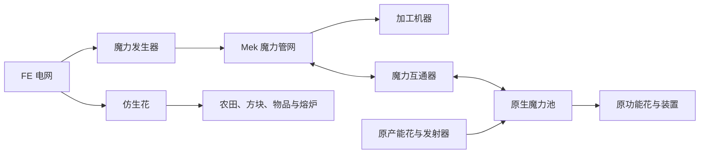

# Botania × Mekanism 设计提案

研究日期：2026-09-12。目标：[Botania `1.21.1-porting`](https://github.com/VazkiiMods/Botania/tree/d617ef057edf7a4b4fb6c6ee6045c973a80bfb05)。

**已确定：FE 产魔力、原生魔力互通、增加仿生花，仿生花保留对应原花的模型和贴图。** 本文其余机器清单、数值与开发顺序是建议方案，尚未实现。所有上游事实的源码入口见 [UPSTREAM.md](UPSTREAM.md)。

## 1. 总体方向

将扩展分成三条可以分别交付的产品线：

| 产品线 | 玩家得到什么 | 与 Botania 的关系 |
| --- | --- | --- |
| 魔力网络 | 用 FE 产魔力，通过 Mek 管道分配，并与原魔力池交换 | 原产能花、发射器、魔力池和火花仍可使用 |
| 加工机器 | 稳定供料、配方选择、自动取出、断电保存进度 | 读取实际配方与成本，保留催化物、容器和阶段材料 |
| 仿生花 | 原花造型和世界功能，接 FE 后工作 | 优先沿用原花真实行为，供能与保存由本扩展补齐 |

先覆盖生产与资源，再扩展世界交互。普通装备合成、饰品、法杖和红石工具沿用原有系统；不为每个物品复制一台机器。盖亚战斗、遗物归属和玩家成就保留独立评审，避免用普通配方替代原来的世界过程。

## 2. 版本与实施门槛

用户指定移植分支，研究 SHA 为 `d617ef057edf7a4b4fb6c6ee6045c973a80bfb05`，该提交日期为 2026-09-08。官方发布渠道当前列出的是 1.20.1-455，不能把它用于本项目的 1.21.1 编译。分支源码声明的 build number 456 也不等于已经取得正式的 1.21.1-456 发布 JAR。

| 项目 | 设计基线 |
| --- | --- |
| Minecraft／Java | 1.21.1／21 |
| 本仓库 NeoForge／Mekanism | 21.1.241／1.21.1-10.7.19.85 |
| 上游分支 NeoForge | 21.1.229，源码依赖声明下限；241 尚需实际启动验证 |
| 上游 Patchouli／Curios | 1.21.1-92-NEOFORGE／9.5.1+1.21.1 |
| 上游 JEI | 19.27.0.340，区别于现有三个扩展的基线 |
| 发布来源 | 开发前构建或取得固定 SHA 对应 JAR，记录校验值和必要依赖 |

P0 先证明这一组合可编译并进入无界面服务器，再冻结扩展依赖。之后升级 Botania 时以提交为单位复核接口，不跟随浮动分支静默更新。当前文档不代表这些依赖已运行通过。

## 3. 魔力网络与能耗

### 3.1 三种资源之间的关系

建议将可通过 Mek 管道运输的魔力注册为本扩展 Chemical，**1 单位对应 1 Botania 魔力**。这只是管网表示，不给原魔力池增加第二份库存。

- 加工机器：一份 Chemical 魔力库存，供本机加工消耗。
- 魔力互通器：一份 Chemical 缓存，按模式与相邻原池转移；原池仍保存自己的魔力。
- 仿生花：FE 储能与原花内部已付费魔力缓存，后者只供该花工作，不能抽出到外部管网。
- 原生火花与发射器首先通过原魔力池接入。首版不同时把每一台加工机器注册成原生魔力池，避免所有绑定、火花升级和物品充魔语义一并进入首版范围。

### 3.2 魔力发生器

独立 Mek 机器，输入 FE、输出 Chemical 魔力。建议初始基线为 **20 FE → 1 魔力**、**100 魔力/tick**，满速需 **2,000 FE/tick**。这些是待原型验证的平衡数值。

原生魔力转换器在 NeoForge 上为 **1 魔力 → 10 FE**。上述建议意味着直接往返至多回收 50% 电量。发生器的**兑换率不套用 Mek 能量升级的加工折扣**；速度升级提高产量时同步提高 FE 消耗，能量升级用于缓存容量。配置和所有升级组合都必须守住兑换边界。[源码](https://github.com/VazkiiMods/Botania/blob/d617ef057edf7a4b4fb6c6ee6045c973a80bfb05/Xplat/src/main/java/vazkii/botania/common/block/block_entity/mana/PowerGeneratorBlockEntity.java)

缓存只剩部分容量时按可接收量生产；满罐、暂停或红石禁止时不生成。使用整数单位和明确余数规则，不逐 tick 四舍五入损失或制造资源。

### 3.3 魔力互通器

玩家将它放在原魔力池旁边，用界面选择“从池抽取”或“向池供给”。连接面随朝向换算；默认只访问指定相邻面，切换模式立即改变实际传输方向。管道面与原池连接面分开。

首版支持已经核对过的普通、稀释和华丽魔力池。创造池不进入生存资源守恒路径。第三方池需要单独适配，不能把任何 `ManaReceiver` 当成可正负转移的储罐。

实现时先读双方数量和空间，限定当次转移量，再执行并按实际变化结算。`receiveMana` 没有模拟或返回值，模拟请求只能做只读容量计算；需要从具体池确认负值抽取、容量和身份契约。每次访问核对区块、方块实体、面配置和模式；不能从魔力虚空的 `isFull=false` 推断它能无损接收无限资源。

### 3.4 魔力充能座

给石板、魔力戒指等可存魔物品提供管道自动充放魔：一个待处理槽、一个完成输出槽，支持目标百分比和充入／抽出模式。不能只用物品名称判定，使用当前 `ManaItem.LOOKUP`，遵守物品的接收、抽取和禁止输出标志。

部分物品要求真实池上下文。首版优先做依附相邻原池的充能座；P0 证明上下文契约后再决定是否可由机器本身安全提供池接口。泰拉粉碎者成长、装备修复等特殊行为另列适配，不能承诺所有有魔力相关提示的装备都能充放。

## 4. 加工机器清单

以下共建议 **10 种加工设备**，加上发生器、互通器、充能座构成完整候选目录，不要求一次做完。

| 设备暂名 | 用途与主要输入 | 资源与保留条件 | 推荐批次 |
| --- | --- | --- | --- |
| 花瓣调合室 | 花瓣与原配方材料 → 花；独立终结材料槽和水罐 | FE；每批建议 1,000 mB 水；终结材料取配方 reagent | P1 |
| 魔力灌注室 | 魔力钢、魔力钻石、魔力珍珠、炼金和复制转化 | FE＋配方魔力；催化槽装原催化方块，保留 | P1 |
| 符文锻造室 | 元素、季节等符文及可适配特殊配方 | FE＋配方魔力；保留 catalysts，消耗 reagent，处理剩余物 | P1 |
| 纯净转化室 | 白雏菊的活木、活石等转化 | FE；白雏菊原配方不额外收魔力；首批仅支持安全的物品化转化 | P1 |
| 泰拉凝聚室 | 魔力钢、魔力珍珠、魔力钻石等 → 凝聚产物 | FE＋配方魔力；保留原 3×3 平台材料要求 | P2 |
| 植物酿造室 | 原植物酿造材料＋对应容器 → 酿造物 | FE＋容器实际要求的魔力；保留容器组件与配方剩余物 | P2 |
| 凝矿室 | 石质原料 → 凝矿兰／炎矿兰对应矿石 | FE＋选中配方成本；使用对应原花作为保留组件，按权重抽样 | P2 |
| 异构石材室 | 原料 → 异构花石材 | FE＋配方魔力；保留生物群系权重，不能任意点选稀有产物 | P2 |
| 精灵贸易控制器 | 自动向真实精灵门交付材料并接收全部交易产物 | 控制器搬运耗 FE；门开启与交易费用仍由原池承担 | P3 |
| 魔力附魔控制器 | 向真实魔力附魔装置供装备和附魔书并取回 | FE 搬运＋原附魔魔力；保留附魔书、有效附魔与原结构规则 | P3 |

独立加工机把物品直接输出到自己的输出槽，支持 Mek 自动弹出。P3 控制器只与紧邻的真实装置关联，一个原装置最多一个控制器；不提供跨区块的远程绑定。

### 4.1 花瓣与符文：材料区按 16 项设计

不能照搬现有扩展的八格或九格材料区：当前花瓣配方已有 16 项材料的例子，符文实现允许材料和催化物合计最多 16 项。建议两台设备采用 4×4 材料区，另加终结材料槽和六格输出。

符文的催化物仍从完整配方输入中匹配，正常生产后留回原槽；不能因为用了高级符文就统一消耗，也不能根据 RuneItem 类型一概保留。调用原 `getRemainingItems` 处理催化物和容器，空间不足时停止。所有参与配方的对象使用副本，实际提交时才消耗。

### 4.2 魔力灌注：保留催化与动态结果

同一台设备处理普通灌注、炼金和复制，由催化槽和配方选择决定。沿用原生“匹配催化配方优先”的顺序；不能因为材料相同就误做普通转化。

调用 `getRecipeOutput` 取得真实结果并保留组件，不调用返回空的通用 `assemble`。首版催化槽仅解释已核对的原催化方块状态；有自定义状态、额外世界依赖或副作用的第三方配方列为待适配，不假装全部支持。

### 4.3 白雏菊：不是普通物品配方

白雏菊 API 接收世界位置和 BlockState，可能调用世界函数。当前原生深板岩转化就带 `pre_update_function`；因此不能把全部配方仅按输入输出做进机器。

首批只接入已确认的纯状态转化，输入与输出必须能安全表示成物品，且无世界回调。水、其他流体、需世界函数或特殊位置检查的配方仍由原白雏菊处理，后续另做真实工作区。界面与 JEI 转移只接受本机已支持的集合。

原花轮流检查八个位置，`getTime()` 是目标被检查的次数；例如活石配方 time=150，对单一位置约为 1,200 游戏 tick，不能误写成 150 tick。机器可以按八路并行与速度升级设计，但必须明确基准吞吐，而不是无意获得八倍速度。[源码与配方](https://github.com/VazkiiMods/Botania/blob/d617ef057edf7a4b4fb6c6ee6045c973a80bfb05/Xplat/src/main/java/vazkii/botania/common/block/block_entity/flower/misc/PureDaisyBlockEntity.java)

### 4.4 泰拉、凝矿与异构：保留阶段和随机规则

泰拉凝聚室在原平台中心工作，读取对应平台标签；投入原材料、整批原魔力成本和本机 FE。原型要证明平台损坏、重载与输出满时资源不会丢失。建议机内进度暂停保存，而非复制原散落物品失效后魔力消散的交互，这属于本扩展明确的体验变化。

凝矿和异构使用当前配方的 `getManaCost()`、`getCooldown()`、位置相关权重及输出方法。按实际原料匹配，不能只按维度名称猜矿表；炎矿条件和 Garden of Glass 条件须按实际配方与原花分别核对。

随机产物在完整提交阶段只抽一次。提交前按候选的最大消耗与产物预留空间，提交后扣实际选中成本。异常中断后以已付费批次恢复，不能让重载、暂停或输出阻塞触发重抽。具体配方带世界回调时采取与白雏菊相同的支持边界。

### 4.5 酿造、精灵贸易与附魔

酿造成本来自 `BrewContainer.getManaCost`，拒绝值不能当零费用。生成结果使用原容器输出方法；植物酿造系统与普通 Minecraft 药水不同，不能直接复用 Ars 的药水罐模型。

精灵门保留真实门框、自然水晶和魔力池。当前分支开启总成本常量为 200,000，单次解析交易为 500，按有效池数量分摊。控制器不能既让门扣费又从机内再扣一次，也不能只收材料而免除开门条件。输出使用 `tryAssemble` 的全部结果与 `matchedInputSlots` 数量；词典升级和原样退回配方单独处理，避免自动循环。

附魔不是独立 RecipeType。附魔书保留、物品是否允许附魔、当前附魔和冲突、世界结构以及上游配置都必须交给对应规则。P3 先验证真实装置控制，不能先复制一份简化公式做出与原装置不同的结果。

## 5. 仿生花：原花外观，FE 供能

### 5.1 首批六种

建议先做六种普通地栽功能花，形成可组合的生产线。名称加“仿生”前缀，保留原花轮廓、颜色、模型、贴图和选取形状。

| 仿生花 | 保留的原用途 | 必须保留的限制 | 建议用途 |
| --- | --- | --- | --- |
| 仿生翡翠苋 | 在合适地面生成随机神秘花 | 需要可生长空间，读取原花标签；不固定指定颜色 | 神秘花与花瓣供给 |
| 仿生粘土花 | 消耗世界中的沙，产生粘土球 | 当前分支一次原操作产 **1 个粘土球**，不是整块粘土 | 接方块放置和收集线 |
| 仿生田园康乃馨 | 加快合适植物的生长尝试 | 原标签、目标判定、随机生长／骨粉逻辑；一次尝试不保证生长成功 | 农业与产能花原料供给 |
| 仿生漏斗花 | 收集掉落物并送入原规则允许的相邻容器 | 物品框筛选、拾取延迟、范围及容器满的处理 | 收集花瓣、粘土与其他世界产物 |
| 仿生手掌花 | 从世界物品放置对应方块 | 原模式、支撑与目标条件、实际物品消耗；不能复制方块 | 自动补沙和补石 |
| 仿生冶炼火 | 给可被原花加热的装置供热并推动烹煮 | 查询 `ExoflameHeatable`，遵循目标可加工条件；不把所有机器强制设为燃烧 | 熔炉组供热 |

原翡翠苋每次生花扣 100 魔力、粘土花扣 80、田园康乃馨每次生长尝试扣 5。在统一建议倍率 20 FE/魔力下，可分别作为 2,000、1,600、100 FE 的工作预算基准；最终以原花实际扣费点结算。漏斗花、手掌花和冶炼火需要额外核对无魔力基础行为及供热／加速差异，不能简单按掉落数量或炉内物品数量计费。

### 5.2 供电和操作

首版 FE capability 暴露在仿生花自身的相邻面，玩家可以从花侧面接 Mek 电缆，土地继续支撑花。若要隐藏布线，再追加可作为合法种植地面的供电基座；它只是布线部件，不改变花模型。不要首版就引入大范围无线扫描供电。

仿生花沿用森林法杖的原功能设置，FE、暂停状态与工作范围通过简短 HUD 查看。没有配置需求的花不强加整页机器 GUI。可用名称与 HUD 区分仿生版本，不需要重画花瓣或加金属轮廓。

首批不加速度和范围升级，先证明原行为与供电一致；否则同时改变扫描、随机频率和能耗，难以确认基础契约。后续升级放到统一控件或供电基座中，避免每朵花新增一套菜单。

进入原花世界扫描前核对作用区域已加载，缺区块时暂停。首批不启用红线仿制的远端作用，后续适配再核对实际作用位置、供电位置与区块边界；不能让复用原 tick 绕过本仓库的不强制加载要求。

### 5.3 原生行为复用方案

建议新增本扩展的仿生方块／物品，引用原模型，复用相应原花 BlockEntity 类型。上游已有 `BlockEntityTypeAddBlocksEvent.modify` 的用法，可在 P0 验证这些类型接受新增方块。相应红石敏感接口、方块状态属性、功能模式和方块事件必须一起匹配，不能只给新方块挂旧 tick。

供能适配只作用于本扩展注册的仿生方块：

1. FE 按比例充入原花内部的一份魔力缓存，作为已付费工作储备；不再绑定或抽取附近原生池。
2. 原花仍按自身逻辑消耗这份缓存；不额外创建一个隐藏原花，不手动多调用 tick 加速，也不复制各花整段工作代码。
3. FE 与尚未使用的工作储备均保存，拆装时也保留。HUD 可用 FE 等值显示储备，避免扣电后看起来资源消失。
4. 工作储备没有通用魔力输出接口，不能被转换回池或管道。总可用额度不足时停止，尤其防止漏斗花、手掌花回落原生无魔力基础模式。
5. 保留原生按“有效尝试”收费的地方：如田园康乃馨施加一次有效生长尝试，即使植物这次没有长大，也不退款重新抽随机数。

上述路径是待原型验证的实施建议。若原花的构造、掉落或模式耦合使复用不可行，先调整适配边界，不扩大到修改所有原花的全局规则。需要 Mixin 时仅限上述供能和保存入口，并以原始方块作为对照测试。

### 5.4 后续花的取舍

| 候选组 | 后续方向 |
| --- | --- |
| 凝矿兰、炎矿兰、异构花 | 原位改造型候选，保留世界转化；与机内加工的凝矿室形成不同摆放选择 |
| 畜牧花及其他生物作用花 | 单独评估实体事件、食物、冷却和掉落；通过原生行为验收后追加 |
| 仿生产能花 | 可考虑火红莲、彼方兰等；必须保留燃料／食物及多样性等差异，FE 用途另定，避免做成外形不同但完全同功能的发生器 |
| 聚宝花 | 保留原生召怪、结构与掉落流程，暂不做“直接抽宝箱物品”的机器 |
| 热爆花、启命英、勿落草等 | 爆炸来源、生命游戏或实体互动是核心玩法，先保留原生系统并给它供料／收集 |
| 漂浮和迷你仿生花 | 第二轮外观兼容；核对漂浮标签、岛屿数据、原尺寸和范围，不在同一个实体上强切地栽／漂浮状态 |

## 6. 进度与平衡

建议按原材料阶段开放机器，而非依赖全局玩家成就。多人服务器上的机器不应因拥有者离线或换人而失效。

| 阶段 | 建议解锁 |
| --- | --- |
| 活木／活石与初始魔力钢 | 发生器、互通器、花瓣调合、基础灌注、纯净转化 |
| 元素符文与基础功能花 | 符文锻造、首批仿生花、酿造 |
| 首份泰拉钢与精灵材料 | 泰拉凝聚工业化、凝矿／异构、扩充魔力缓存 |
| 已建设完整精灵门与附魔装置 | 对应物流控制器 |
| 盖亚阶段 | 可选高级吞吐与后续花；不自动产盖亚之魂或解除遗物绑定 |

机器合成使用原装置、对应原花或阶段材料作为一次性成本。仿生花建议用对应原花加控制部件制作，让外观、用途与合成来源一致，不增加无用途的多层中间核心。

下表仅用发生器初始建议吞吐估算资源规模，不是机器加工时间：

| 原配方例子 | 源码魔力 | 20 FE/魔力所需电量 | 100 魔力/tick 的纯供魔时间 |
| --- | ---: | ---: | ---: |
| 魔力钢锭 | 3,000 | 60,000 FE | 1.5 秒 |
| 魔力珍珠 | 6,000 | 120,000 FE | 3 秒 |
| 魔力钻石 | 10,000 | 200,000 FE | 5 秒 |
| 泰拉钢锭的凝聚步骤 | 500,000 | 10,000,000 FE | 250 秒 |

泰拉钢这一行不含前三种材料的制备成本。机器 FE 驱动成本另计，魔力成本沿用原配方；速度升级改变加工吞吐，普通加工机的能量升级仅作用于自己的机械 FE。

## 7. 界面、物流和保存

普通机采用 Mek 界面。材料、终结材料、催化部件和输出按用途分区；花瓣与符文使用宽版材料区，其他设备使用紧凑版。此阶段不冻结像素坐标，避免尚未确定的槽位硬挤进前三个扩展的固定窗口。

- 选择器使用产物图标、本地化名称和搜索；炼金／复制按催化筛选，随机矿表不提供指定结果按钮。
- 物品输入、额外输入、成品输出、Chemical 输入和能量分别进入真实六面配置。默认前／左供料、上方补给、右侧出料，再按具体槽位确认。
- 所有输出、容器及催化物返还在提交前预留；产物直接进唯一输出区。多产物配方不能只保存第一个。
- 暂停、断电、无材料和输出满分别显示原因。已有库存可按设置转移；暂停不要求清空机器。
- 配方、组件、催化、成本与有效工期进入工作签名；补充同类库存不无故清零。配方重载使缓存失效；已付费待输出批次保留。
- 世界库存、拆装组件和菜单同步分别接入；引用原装置的控制器不把原装置库存重复存到自己物品中。
- 仿生花不生成 16×16 工业四面贴图，而引用原生花模型；普通机器外壳仍按仓库 Mek 风格制作，待机器清单确定后再出图。

## 8. JEI 与自动化兼容

上游已有白雏菊、魔力池、花药台、符文祭坛、精灵贸易、植物酿造、泰拉凝聚、凝矿兰、炎矿兰和异构花十类 JEI 页面。机器添加到相应类别的工作设备列表，沿用原版布局，不新增重复分类。

类别显示所有原生配方，并不表示本机能执行所有第三方实现。配方转移和机器选择器必须使用服务端同一份支持判断；世界回调和未适配容器给出明确原因。

仿生花配方使用普通工作台分类。涉及多槽输入与催化物的转移不能忽略额外 reagent；仍需一次真实管道输入、已有堆叠继续补入、满输出停止和恢复的验收。

## 9. 分阶段交付

| 阶段 | 实际内容 | 结束条件 |
| --- | --- | --- |
| P0：验证设计可实现 | 固定 Botania JAR 和依赖；互通原型；一种仿生花原型 | FE／魔力守恒，原花模型可引用，存档与原生行为契约明确 |
| P1：基础生产线 | 发生器、互通器；花瓣、灌注、符文、纯净四种加工机 | 从箱子和电网进料，经真实管道生产并输出；JEI 可查可选 |
| P2：仿生与进阶加工 | 六种仿生花；泰拉、酿造、凝矿、异构；充能座 | 原生对照、随机与组件保存、循环能量检查通过 |
| P3：原装置控制 | 精灵贸易和魔力附魔控制器 | 真实原结构、付费、权限、满输出和拆装无损；再评估后续花 |

仿生花在 P0 就验证技术路径，避免等全部机器完成后才发现原生模型或保存方式无法接入。P1 与 P2 的排期可以根据该原型结果调整；不预设开发天数或凑固定测试数量。

## 10. 重点验收案例

| 风险 | 最小有效验证 |
| --- | --- |
| 电力循环 | 发生器 → Chemical → 原池 → 原发射器 → 原魔力转换器，检查默认及全部升级后无净增电 |
| 转换丢失或复制 | 小于一批的池空间、两方向切换、模拟调用、断开及缓存 handler；双方总量变化精确对应 |
| 配方误扣 | 符文 catalysts／reagent、花瓣水与种子、灌注动态组件、酿造实际容器、多产物精灵交易 |
| 世界配方被简化 | 带函数的白雏菊配方不能进入纯物品加工；真实工作区路径另验事件和位置 |
| 随机重抽 | 输出阻塞、暂停、存档重载和拆装后，已付费批次结果不改变 |
| 仿生花偏离原行为 | 同样目标分别给原花魔力和仿生花 FE，对照消耗、范围、模式和产物；普通原花不受适配影响 |
| 断供仍免费工作 | 漏斗花和手掌花用完预算后停机；满箱不吞物品，无可放位置不消耗方块 |
| 多扣或漏扣尝试费 | 田园康乃馨无适用植物时不收费；有效生长尝试按原语义付费，不以随机结果决定退款 |
| 仿生花丢失储备 | FE、内部工作储备、原模式及冷却经世界保存、掉落组件与重新放置保留 |
| 原模型失效 | 方块、物品、cutout、状态属性、资源包覆盖；浮空与小型版本单独验收 |
| 原控制器覆盖库存 | 原装置库存唯一、满输出停止、结构损坏断开、修复恢复；无强制加载区块 |

逻辑按相关范围运行无界面服务器；客户端视觉、布线观感和整合包体验由用户验收。当前方案没有宣称这些案例已经通过。

## 11. 本轮结论与待评审项

建议从 **魔力网络＋四台基础加工机** 起步，在同一轮先验证一朵仿生花，再扩到六种。完整候选包括 3 种资源设备、10 种加工／控制设备和首批 6 种仿生花；这是分阶段目录，不是一次性实现承诺。

已确认的用户选择无需再次询问。后续设计评审集中在三点：首批六种花是否替换或增加、20 FE/魔力与基础吞吐是否合适，以及精灵／附魔保留原结构的方案是否符合期望。实施前首先完成 P0，对实际 JAR 和关键适配方式给出可运行证据。
