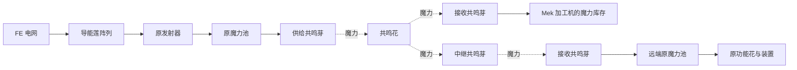

# 火花传输与旧共鸣网络兼容

**alpha.7 起，新使用流程改为原生火花＋共鸣增幅器。** 用户确认不需要额外的选网、成员或优先级，保留原染色、法杖和升级操作，仅增强距离。机器直接接受原火花；双端安装增幅器后，各轴范围扩展至 32 格，仍用原火花实际传输与扣魔，详见 [README](README.md)。

**共鸣花模型、贴图和原稿明确保留，用于后续新功能。** 共鸣花／芽现有注册和存档兼容保留，只退出新合成与创造列表。以下记录的是 alpha.1–alpha.6 的旧机制，供维护已有世界参考，不再作为新生产线的必需方案。

范围暂按**同维度、可中继的基地网络**设计。无限距离和跨维度留作后期独立评审，不因网络名字相同就跨越所有距离。

## 1. 玩家如何使用

建议新增两种部件：

| 部件暂名 | 用途 | 外观与安装 |
| --- | --- | --- |
| 共鸣花 | 创建并管理一个网络，显示成员、流量和状态 | 花形核心，花蕊带小型同心环与柔和光点；不产魔力 |
| 共鸣芽 | 作为供给端、接收端或中继；同一个部件切换用途 | 小花蕾或花蕊状节点，以颜色显示收发状态；不存魔力 |

两者采用本扩展仿生花的通用承托规则，可以安装在石、玻璃、机壳等表面，无草地／泥土要求。节点不需要另外接 FE，无线费用从供给端的魔力支付；空闲不收费。

最基本的布置：

1. 在基地放一株共鸣花，起名“主基地魔网”，默认仅本人可配置。
2. 在已有魔力池旁安装共鸣芽，指定相邻池并设为“供给”，选择这个网络。
3. 在加工机或另一座池旁安装共鸣芽，指定目标并设为“接收”，选择同一网络。
4. 必要时调整供给保留量、接收目标量和优先级。超出直连距离时，用另一颗共鸣芽设为“中继”。

界面使用网络名称、目标图标和方向，不输入内部 ID。节点只绑定一个相邻目标；不会扫描周围所有池并自动抽取。

图中的共鸣花和共鸣芽只负责建立路径和执行转移，魔力不落入这些部件的隐藏库存。

## 2. 接入范围

| 对象 | 首版接入方式 | 边界 |
| --- | --- | --- |
| 已核对的原生魔力池 | 相邻供给／接收共鸣芽直接访问池 | 一份原池库存；支持普通、稀释、华丽池；创造池排除在生存路径外 |
| 本扩展的加工机器 | 相邻接收芽向该面的 Chemical 魔力输入 | 与管道共享同一份魔力库存，遵守六面配置；费用不从机器另扣一遍 |
| Mek 魔力储存与管网 | 经本扩展可验证的 Chemical 端口接入 | 首版优先本扩展自身设备，其他容器逐项核对模拟和限额语义 |
| 原产能花与导能莲 | 先走原发射器入池，再由供给芽入网 | 不直接抽取产能花内部缓存，不增加第二条出魔路径 |
| 原功能花、原符文祭坛等 | 无线供给附近原池，继续使用原绑定／发射器／火花 | 直接向任意 ManaReceiver 送魔不作为首版保证 |
| 六种 FE 仿生功能花 | 保持原设计的 FE 供能 | 本网络只传魔力，不无线输送 FE，也不抽取花内已付费工作储备 |
| 魔力物品 | 经充能座或原池 | 不远程修改玩家背包、装备或物品实体 |

接收芽装在加工机哪一面，就使用哪一面的真实输入能力。关闭该面或把它设为输出时，无线输入也立即停止。不能通过无方向或 INTERNAL 插入绕过用户设置。

共鸣芽使用三种互斥模式：**供给、接收、中继**。首版不设自动双向平衡，避免同一池在网络里反复进出。模式切换立即作废待执行路径并重新核对权限与容量。

同一实际库存只能有一个活动无线端点。控制器与多方块端口的不同坐标如果指向同一份库存，要识别成同一个目标；不能多贴几个节点就绕过端点限额。与正常有线管道或原生火花并用时仍逐次核对实时库存。

## 3. 网络拓扑与覆盖

建议采用**一株共鸣花为中心的树状网络**。端点可以直接连接核心，或通过一个中继连接核心；首版每一侧最多一层中继。

| 参数 | 基础网络建议值 | 说明 |
| --- | ---: | --- |
| 单条无线链路 | 32 格 | 同维度三维直线距离，包含高度差；不是 32 格立方扫描半径 |
| 核心到端点 | 最多 2 跳 | 核心 → 端点，或核心 → 中继 → 端点 |
| 一次供给到接收 | 最多 4 跳 | 两端都经中继时为最长路径 |
| 非核心节点 | 最多 16 个 | 供给、接收、中继共同占用名额 |
| 同一网络核心 | 1 株 | 复制核心或同 ID 放两株不会得到双倍吞吐 |

直连覆盖核心周围 32 格，通过一层中继可扩到距核心最多约 64 格，实际取决于摆放。两端相距超过 32 格也可通信，但必须存在符合上述距离与层数的完整路径。

允许隔墙传输，不扫描射线经过的方块。必须加载的是核心、供给端、接收端、中继与对应资源容器；无线线段途经的区块不需要读取，也不会因此加载。

核心不在线时本网络暂停；某个中继卸载时只暂停经过它的路径，其余直连部分可继续。恢复后按当前库存重新调度，不补发卸载期间的流量或产量。

## 4. 带宽与公平分配

建议使用较远覆盖和可控调度换取较低的初始带宽，保留原生火花在装置近旁大量传魔的用途。

| 限额 | 基础网络建议值 |
| --- | ---: |
| 全网交付总量 | 128 魔力／tick |
| 单个供给或接收端 | 64 魔力／tick |
| 单个中继合计转发 | 128 魔力／tick |
| 调度间隔 | 5 游戏 tick |

调度按 5 tick 批次执行：全网每批最多交付 640、每端最多 320、每中继最多转发 640。界面显示等效每 tick／每秒流量；不把每次回调重新当成一批，也不累计离线额度。这里的“魔力”按最终交付量计算，无线费用另计。

一笔转移 q：占用一次全网 q 额度、供给端和接收端各 q 额度，并在经过的每个中继占用 q 额度。核心不把同一笔的收入和发出重复计为 2q。多条路径共享实际经过的中继预算，不能每个连接各算一份 128。

接收端提供高、普通、低三档优先级，建议权重 **4∶2∶1**，同档轮转并保留分配余数。高优先级获得更多服务，但持续有资源时低优先级也不会被完全饿死。某端已满或达到目标储量，额度让给其他有需求端；不预留给离线目标。

供给端的“保留量”是不能动用的底线，接收端的“目标量”是停止补给的上限。例：精灵门的池保留 200,000，炼金机补至 20,000，其他机器用剩余带宽。多个节点不能在各自计划中同时花掉同一份源魔力。

## 5. 无线费用与整数结算

建议收费为：**每交付 50 魔力，每经过一条无线链路，额外消耗 1 魔力**。即每跳按到货量加收 2%，没有空闲维护费、扫描费或失败重试费。

- 供给芽 → 共鸣花 → 接收芽为 2 跳：到货 100，额外消耗 4，供给端实际减少 104。
- 两端都使用中继为 4 跳：到货 100，额外消耗 8，供给端实际减少 108。
- 费用只从该笔供给端支付；供给保留量必须在扣除货物和费用后仍满足。
- 目标已满、路径失效、模式不符或权限不足时，不抽取魔力，也不收取费用。

为避免小额传输每次向上取整都被重罚，使用网络级的**预付传输额度**，范围为 0～49 个“魔力×跳”。首次需要额度时先付 1 魔力，获得 50 单位额度；每交付 q、经过 h 跳，消耗 q×h 单位额度。

若当前剩余额度为 c，本次额外费用为 `ceil(max(0, q×h-c) / 50)`，新额度为 `c + 50×费用 - q×h`。因此小包累计与同等总路程的大包收费一致，只存在不足 1 魔力的预付余量。额度记录在服务器网络数据中，拆节点、换路或移动核心不重置，不能作为魔力提取或复制。

同样的 100 魔力交付，2 跳需 104 魔力，4 跳需 108。按导能莲 50 FE／魔力折算，分别约为 52 和 54 FE／到货魔力，未含原发射器耗散；不会改变花的生产兑换率。

## 6. 与当前产能的配合

16 株导能莲理论生成 64 魔力／tick、消耗 3,200 FE／tick。经过 2 跳网络，扣除无线费后稳态交付上限约 **61.5 魔力／tick**；4 跳约 **59.3 魔力／tick**。均未计算原发射器的损耗与堵塞。

这样一座基础网络能服务数台机器，也有足够带宽接更多供给池。单端 64 的限制使某一台机器不会轻易占满全网；需要更高单机吞吐时可以继续使用有线管道或原生火花。

建议共鸣花与共鸣芽使用精灵材料、原火花及控制部件合成，在完成一次原生精灵贸易后开放。它提供的是基地布局便利和供魔管理，不是开局代替全部原生传输。

后续可评估高级网络：单链路 64 格、全网 512／tick、端点 128／tick、32 个节点。升级需后期材料，费用比例不打折；同一物理部件不能通过添加几个同名网络获得多份带宽。跨维度单独设计明确的两端装置、费用和区块条件，不与普通范围升级混为一项。

## 7. 权限、命名与操作界面

网络身份使用服务器分配的 UUID，显示名称和颜色只是帮助辨认。两个玩家取同名、同色网络，也不会自动互通。首版默认私人网络，核心管理者可以授权具体玩家加入；加入和修改配置都需要服务器校验。

创建者离线不使已加载网络停机。权限针对操作者和节点接入资格，不将持续生产绑定到在线玩家对象。节点只能访问玩家主动指定且允许访问的相邻目标；原池没有自身所有者时仍遵循相应世界交互／保护规则，不能据此扫描抽取周围池。

| 界面 | 应显示的内容 |
| --- | --- |
| 共鸣花主面板 | 网络名、访问成员、在线节点／上限、实际交付量、费用、带宽利用率 |
| 节点列表 | 目标图标与名称、收发模式、保留／目标量、优先级、跳数、当前状态 |
| 共鸣芽配置 | 可加入网络列表、相邻目标与方向、模式、目标量／保留量、优先级 |
| 森林法杖查看 | 临时连接线、范围和中继路径；平时只显示少量有流量时的粒子 |

具体状态分别显示“无供给”“保留量不足”“等待带宽”“目标已满”“此面未开放魔力输入”“中继未加载”“超出范围”“核心离线”“无接入权限”。离线库存显示未测量，不假装为零；全网可用量只统计当前可访问的已加载供给端。

所有设置通过当前菜单提交，校验距离、节点身份、核心权限、参数范围和网络归属；直接伪造颜色或物品 NBT 不获得网络访问权。首版不添加全服公共自动吸取网络。

## 8. 库存、存档与故障语义

**实际魔力始终由原池或机器保存。** 网络的服务器数据只保存身份、权限、节点信息、调度游标和计费余量，没有全网总魔力账户。节点图标中的“流量”也不是另一个资源库存。

转移在服务器主线程按一笔一笔执行：核对来源、去向和完整路径；预留带宽、到货空间和包含费用的源数量；执行并依据实际接受量结算。首版只接受有明确守恒契约的适配器，不依靠随意向 ManaReceiver 传负数实现通用抽取。

已经交付的魔力立即存在目标中；失败时源资源保留。不要先扣一批放进不可见的“网络队列”再等接收端上线。运行时待选路径不写成在途物品或魔力，保存／恢复后重新计算。

节点与核心拆装保留配置，但放回后重新校验相邻目标和接入权限。核心的网络 ID 可以随物品保存，网络本体数据由服务器持有；第二个同 ID 核心不能同时激活。原核心丢失后的接管由拥有者显式处理，不按名称自动认领。

原生火花或有线管道同时修改池时，每笔无线操作仍重读真实数量和空间。一个端点从接收切换为供给时，旧计划立即失效；树状路径不沿着环重复传输，同一请求不能被两个调度器各执行一次。

连接索引随节点加载、卸载、放置、拆除和设置变化更新；只在拓扑失效时重算相邻关系，不每 tick 扫描世界寻找同名网络。成员上限限制单次图计算规模，调度只访问已注册且已加载的端点；配置变更可立即使旧路径失效，图的重建再按预算完成。

## 9. 原生火花的定位

本次指定源码中，原生 `ManaSparkHelper` 在各轴 ±12 的 AABB 内寻找同色火花。`ManaSparkEntity` 的转移常量为 1,000，预算还乘以连接数量，不能把这个常量写成整个网络统一上限。它还包括聚集／分散等升级和停止传输条件。来源见 [上游记录](UPSTREAM.md)。

共鸣花网络保持独立，不修改原火花的颜色、距离或费用。原生火花适合近距离、大吞吐装置；新增网络以更远覆盖、明确权限、资源保留和调度为主要用途。

共鸣节点绑定到池侧或其他空闲邻面，给池上方保留原火花的位置。混用需要真实验证同一个池的总资源变化，不能各自模拟一份影子池。

## 10. 分步实现与验收

| 步骤 | 内容 | 必须拿到的证据 |
| --- | --- | --- |
| W0 原型 | 一源池、一核心、一接收机，含部分接受和小额费用 | 同一份库存、准确扣费、六面配置生效，失败无扣除 |
| W1 基础网络 | 32 格链路、单层中继、16 节点、调度与访问成员 | 范围边界、共享带宽、公平分配、离线与拆装恢复 |
| W2 后期扩展 | 高级核心、更多端点，评估直接原装置接入 | 与原生火花及高负载生产线对照，确认额外复杂度有实际用途 |

基础网络适合安排在总体 P2 的精灵材料阶段。总体 P0 可以先验证 W0 的资源操作方式，避免后续才发现池接口无法保持守恒。

重点验收：

- 32 格边界及高度差；隔墙可达；超距或第二层中继不误连。
- 同名同色但不同 UUID 不互通；无权加入、复制核心或旧节点缓存不能越权传输。
- 3 个以上持续请求端验证 4∶2∶1 权重及低优先级不会饿死；全网、端点、中继预算共同生效。
- 多笔小额与一笔大额在相同总“魔力×跳”下累计费用相同，拆装和重载不重置预付额度。
- 供给保留量、目标容量、模式切换、目标面关闭及容器被替换后，旧计划不继续转移。
- 核心、中继、端点和源／目标区块分别卸载，不强制加载；恢复不补发离线流量。
- 原生火花、有线管道和无线节点共用同一池时，交付量与费用合计不超过源实际扣除。
- 空闲、满目标和失败尝试零收费；导能莲经网络再转 FE 仍无正收益回流。

主线已有可安装构建与服务端验证，结果和当前支持范围见 README。高级网络与可视连接线仍属提案；客户端视觉由玩家验收。
