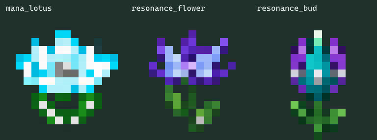

# 原型花形素材

三张原创花形均由内置 ImageGen 制作，完整提示词与导能莲修正步骤见 [prompts.json](prompts.json)。Botania 白雏菊仅作为简单花形和像素比例的本地参考；参考图没有复制到运行资源。

| 原稿 | 用途 |
| --- | --- |
| [mana_lotus.png](source/mana_lotus.png) | 青白花瓣、银灰花蕊和叶脉的导能莲 |
| [resonance_flower.png](source/resonance_flower.png) | 紫色花冠、环形花蕊的无线核心 |
| [resonance_bud.png](source/resonance_bud.png) | 青紫色花苞形收发／中继节点 |

运行时使用透明的 16×16 PNG 和交叉平面植物模型。原稿保留 alpha，由 [export_textures.cjs](../tools/export_textures.cjs) 使用 nearest 机械缩放，不进行代码重绘。预览检查贴图可读性，客户端实际摆放与效果由用户验收。

在本目录执行 `npm install`、`npm run export`；Sharp 由本目录 package.json 解析。导出文件位于 `src/main/resources/assets/botanicalmekanism/textures/block/`，原稿和预览不打入 JAR。

仿生翡翠苋直接引用依赖提供的 `botania:block/jaded_amaranthus` 模型与纹理，没有复制一套原花素材。专用导能莲的原创科技花形是用户明确要求的例外，不适用普通机器的四面机壳图集模板。

机械花药台使用独立的工业机壳图稿 [mechanical_apothecary.png](source/mechanical_apothecary.png)，由内置 ImageGen 生成；完整提示词与导出位置见 [mechanical-apothecary.json](mechanical-apothecary.json)。参考的是本仓库调合机的灰色机壳风格。

同一个导出脚本按等分 2×2 拆出静止正面、顶部、侧面、工作正面，再以 nearest 缩到真正的 16×16。运行资源在 `textures/block/mechanical_apothecary/`；[四面检查图](mechanical-apothecary-sheet.png)和[方块预览](mechanical-apothecary-cube.png)留在美术目录。界面保持简单矩形布局，不使用花瓣／叶片外框。

## alpha.6 资源复用

六种仿生功能花直接引用对应 Botania 方块模型和物品贴图，不打包或重绘原花图片。11 台新增设备直接复用本仓库 Ars-Nouveau 已有原创 16×16 四面贴图，完整源目录和面名见 [machine-texture-reuse.json](machine-texture-reuse.json)。执行 `python tools/generate_resources.py` 时由 `machine_resources.py` 复制到本模组命名空间，保留 front／top／side／front_active。没有新 ImageGen 提示词或伪称新原稿。机器菜单继续使用代码布局与 Mek 控件，未新增花瓣 GUI。
