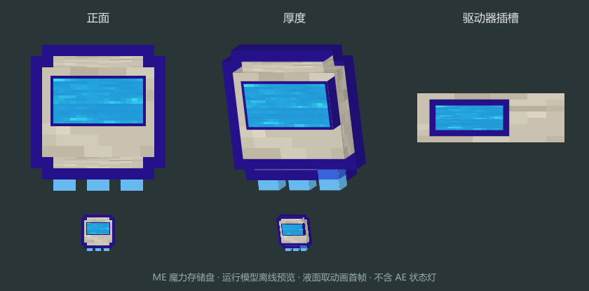
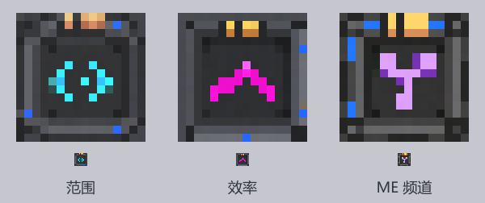

# Botania 花形与装置素材

三张原创花形均由内置 ImageGen 制作，完整提示词与导能莲修正步骤见 [prompts.json](prompts.json)。Botania 白雏菊仅作为简单花形和像素比例的本地参考；参考图没有复制到运行资源。

| 原稿 | 用途 |
| --- | --- |
| [mana_lotus.png](source/mana_lotus.png) | 青白花瓣、银灰花蕊和叶脉的导能莲 |
| [resonance_flower.png](source/resonance_flower.png) | 紫色花冠、环形花蕊的无线核心 |
| [resonance_bud.png](source/resonance_bud.png) | 青紫色花苞形收发／中继节点 |

运行时使用透明的 16×16 PNG 和交叉平面植物模型。原稿保留 alpha，由 [export_textures.cjs](../tools/export_textures.cjs) 使用 nearest 机械缩放，不进行代码重绘。预览检查贴图可读性，客户端实际摆放与效果由用户验收。

在本目录执行 `npm install`、`npm run export`；Sharp 由本目录 package.json 解析。导出文件位于 `src/main/resources/assets/botanicalmekanism/textures/block/`，原稿和预览不打入 JAR。

仿生翡翠苋直接引用依赖提供的 `botania:block/jaded_amaranthus` 模型与纹理，没有复制一套原花素材。专用导能莲的原创科技花形是用户明确要求的例外，不适用普通机器的四面机壳图集模板。

alpha.4–alpha.6 的机械花药台曾使用独立工业机壳图稿 [mechanical_apothecary.png](source/mechanical_apothecary.png)，由内置 ImageGen 生成；完整提示词与导出位置见 [mechanical-apothecary.json](mechanical-apothecary.json)。参考的是本仓库调合机的灰色机壳风格。

旧版导出曾按等分 2×2 拆出静止正面、顶部、侧面、工作正面，再以 nearest 缩到真正的 16×16。运行资源在 `textures/block/mechanical_apothecary/`；[四面检查图](mechanical-apothecary-sheet.png)和[方块预览](mechanical-apothecary-cube.png)留在美术目录。界面保持简单矩形布局，不使用花瓣／叶片外框。

## alpha.6 资源复用

六种仿生功能花直接引用对应 Botania 方块模型和物品贴图，不打包或重绘原花图片。alpha.6 的 11 台新增设备曾直接复用本仓库 Ars-Nouveau 已有原创 16×16 四面贴图，完整源目录和面名见 [machine-texture-reuse.json](machine-texture-reuse.json)。当时由 `machine_resources.py` 复制到本模组命名空间，保留 front／top／side／front_active。没有新 ImageGen 提示词或伪称新原稿。机器菜单继续使用代码布局与 Mek 控件，未新增花瓣 GUI。

## alpha.7 原装置风格

当前 12 台机器用 [botanical_models.py](../tools/botanical_models.py) 生成原创 JSON 几何，运行时引用 Botania 的活石、活木、符文与晶体材质。它们具有独立的碗、台、盘和支架轮廓，选取／碰撞形状由同一份实体几何生成，不再是整方块机壳。没有新的位图重绘，也不复制原材质 PNG。

[模型清单](botanical-machine-models.json)记录原材质引用与元素数。[模型预览](botanical-machines-preview.png)由 `node tools/preview_models.cjs` 读取实际模型、UV 和依赖材质离线渲染；它不是客户端截图。预览脚本使用已有依赖 JAR 与客户端资源缓存。`npm run export` 现在仅导出三种原创花的贴图，避免重建已退役的机壳资源。

**共鸣花模型、运行贴图和 art/source/resonance_flower.png 原稿完整保留，用户计划后续复用。** 共鸣芽资源同样保留，旧网络设备的模型没有被距离升级图标替换。共鸣增幅器使用原 `spark_star` 图标与原火花旋转图标能力。

## alpha.8 仿生织网花

`corporea_orchid` 的方块和物品模型引用保留的共鸣花模型，原模型、运行 PNG 与 art/source 原稿不变；只是新增独立的名称与用途。词典使用 Patchouli 原样式和物品图标，机械花药配方模板由实际配方材料生成，不新增位图背景或另一套书籍素材。

## alpha.10 魔力盘

`tools/generate_resources.py` 生成魔力盘的活石薄壳和魔力珍珠嵌面 JSON 模型，魔力团引用 Botania 火花物品贴图。素材仅按运行路径引用，没有复制或重新绘制第三方 PNG；没有新增 ImageGen 原稿。驱动器内沿用 AE 默认存储盘模型。共鸣花、共鸣芽的模型和原稿不变。

## alpha.12 魔力图标

魔力资源图标直接引用 `botania:block/mana_water`，显示完整方形液面。此材质每帧为 16×16，共 32 帧，沿用原版每帧 2 tick 的动画。GUI 从方块图集取当前帧；存储盘窗口与魔力团模型引用相同材质。没有复制第三方 PNG 到运行资源，也没有新增原稿。最初生成的液滴提案未采用。

## alpha.13 魔力存储盘模型（历史）

曾自行设计活石卡片、魔力钢包边和三段接点；alpha.14 按用户要求替换为 AE 原盘。

## alpha.14 原生 ME 盘

[mana_cell_models.py](../tools/mana_cell_models.py) 直接引用 AE2 原版五档流体存储盘和插槽模型，在原模型上叠加小块 `botania:block/mana_water` 动态标识。保留原外轮廓、厚度、显示方式和各档颜色，未复制或修改原 PNG。物品 LED 复用 AE 状态着色，插槽标签避开原状态灯。

[preview_mana_cell.cjs](../tools/preview_mana_cell.cjs) 从固定 AE2 JAR 读取原素材，从运行 JSON 取得标签位置，输出上下对比预览。上排为 AE 原盘，下排为带魔力标签的盘；不含状态灯，液面只显示首帧，不是游戏截图。

AE 原盘材质与模型属于 Applied Energistics 2 作者，按 [AE2 的素材许可声明](https://github.com/AppliedEnergistics/Applied-Energistics-2/blob/79ee2c704ad62941a426c26b1cb1f76ef5b2ee5a/README.md#license) 使用 CC BY-NC-SA 3.0。此对比预览包含该素材，沿用同一许可；它不属于仓库代码的 MIT 许可。运行资源仅引用依赖中的素材。

alpha.15 修复物品颜色回调漏掉 alpha 导致盘身透明的问题，素材与模型保持上述版本。此离线预览由原图和 JSON 标签位置拼合，不执行 Minecraft 的 ItemColor；不能用它替代渲染回调检查或游戏内验收。

## alpha.16 共面修复与催化符号

`tools/model_surfaces.py` 对原立方体做表面裁切，去除相交内部面和重叠外面，并按原方向重算 UV。12 台装置保留原造型、材质和碰撞实体；无新位图。`botanical-machines-preview.png` 已从生成后的表面重建，轴向共面面积重叠检查为零。

灌注室的催化符号由客户端渲染器调用 Botania 原 PoolOverlayProvider 与 ICON_OVERLAY 图层，显示当前实际生效的内置或底部催化器。这个动态效果不在静态模型预览中，游戏内由用户验收。

## alpha.17 机械火花（旧外观，alpha.21 已移除边框）

机械火花沿用 Botania 原火花贴图和实体渲染，在外侧加一圈由 `mekanism:block/block_steel` 绘制的细框；机械主火花多一个小标记。物品模型使用 NeoForge CompositeModel 引用原火花子模型，框架前后两面都显示，避开原火花平面以免闪烁。原染色星点、升级轨道和幻影墨水由 Botania 渲染器继续处理。

生成入口为 `tools/generate_resources.py`，实体渲染为 `client/MechanicalSparkRenderer`。未复制第三方 PNG 或新增位图；Botania、Mek 材质仅按运行路径引用。实体动态效果由玩家游戏内验收。

## alpha.18 织网花界面

运行时引用 AE2 原 `textures/guis/storagebus.png` 面板及 `textures/guis/states.png` 槽框、设置图标，未复制 PNG 到本模组。筛选为 9×7 格，设置改为左侧工具栏，界面不显示未实现的升级卡槽或优先级按钮。素材归属 AE2 作者，许可同上方 AE 原盘说明（CC BY-NC-SA 3.0）。此改动没有新增位图原稿，游戏内由玩家验收。

## alpha.21 火花与升级（升级外观已于 alpha.24 替换）

用户要求去掉方框。普通机械火花直接引用 `botania:item/mana_spark`，主火花引用 `botania:item/master_corporea_spark`，物品与实体光效一致；实体只覆写基底贴图，保留 Botania 的动画、染色星点、墨水及升级轨道。无需额外框架或新造徽章。

范围升级以原 `rune_of_air` 为主体，效率升级以 `rune_of_mana` 为主体；右上角用原 `spark_star` 添加小型火花标记，区别于普通符文。所有 PNG 均来自运行时 Botania 依赖，未复制、修改或新增位图，原素材归属 Botania 作者并遵循其许可。`generate_resources.py` 维护物品模型，游戏内外观由玩家验收。

## alpha.23 ME 频道模块（外观已于 alpha.24 替换）

频道模块沿用两种火花升级的符文风格，运行时引用 `botania:item/rune_of_pride` 并叠加原 spark_star 小标记。没有新增 PNG、框架或重绘火花；原暖白／蓝紫外观保留。

## alpha.24 原创火花升级

用户要求三种升级自行设计，并否定独立花叶／枝芽的初稿。最终采用 Mek 风格的金属底板、内凹面板和顶部接点，结合 Botania 的魔力钢接边及明亮符号。范围为青色向外弧线，效率为洋红向上折线，频道为淡紫分叉连接。

原稿由内置 ImageGen 生成，参考 Mek 升级卡的结构，以及 Botania 魔力钢、源质锭和火花升级的配色，没有复制符文图案。[原稿清单与完整提示词](spark-upgrades.json)记录三个输出、修订提示及导出参数。原稿保存在 `art/source/spark_*_upgrade.png`，运行材质在 `src/main/resources/assets/botanicalmekanism/textures/item/`。完整正方形是模块底板本体，没有外部背景；没有使用脚本抠图或重绘图案。

在 `art/` 运行 `npm run export:spark-upgrades`，通过 Sharp 最近邻导出三个 16×16 PNG，并核对底板像素完整性；随后从模组根目录运行 `python tools/generate_resources.py` 更新物品模型。生成器采用单层 `minecraft:item/generated`，不再叠加符文主体或火花徽章。

预览上排放大实际 16×16 PNG，下排按原尺寸显示；这是资源预览，不是客户端截图。普通与主火花仍引用 Botania 原火花外观。

## alpha.29 魔力温室

活石底座、活木细柱、魔力钢顶框与玻璃罩由 `tools/botanical_models.py` 生成。只引用原 Botania 和 Minecraft 材质，未新增或重绘 PNG。模型仍经过外表面裁切与共面检查，碰撞体由同一实体几何生成。

装入的花由 `GreenhouseFlowerRenderer` 缩放显示其原方块模型，保留普通／浮空花外形。`botanical-machines-preview.png` 现包含十三种设备；温室的离线模型预览为空罩，实际花由游戏渲染器按槽内物品显示。该预览不是客户端验收。
