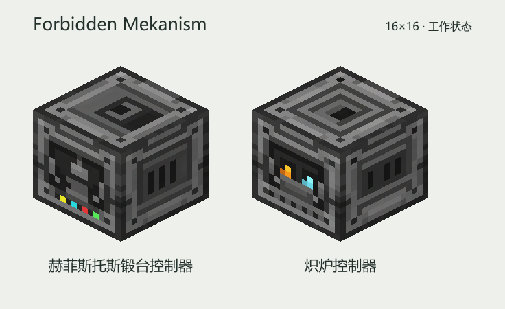

# Forbidden Mekanism

为 Forbidden & Arcanus 提供**赫菲斯托斯锻造室**与**炽炉控制器**，支持 Mekanism 的供电、升级、六面物流、红石与安全设置。

当前版本 **0.2.5**。Minecraft **1.21.1**、Java **21**、NeoForge **21.1.241**、Mekanism **10.7.19.85**、Forbidden & Arcanus **2.6.1**、Valhelsia Core **1.1.4**。JEI 可选。

上图为独立方块外观。炽炉控制器和端口嵌入后采用对应的原炉壳纹理，边缘纹路与周围方块连续，中央小灯用于识别；正面随普通火、灵魂火或附魔火切换。锻造室保留暗石祭坛外观，两台机器继续使用 Mek 界面。

## 赫菲斯托斯锻造室

1. 建造原锻台的 **9×9 地面平台**，将锻造室放在平台中心、地面上方一格。
2. 连接 FE，将配方材料放入左侧九格“原料”，在中部放入所需增强器。
3. 补充**辉光、灵魂、血液、经验点**，选择配方或使用自动匹配，即可连续加工。

原料、增强器、等级和四种资源都保存在锻造室内部。无需绑定原锻台、给外部基座摆料或使用锤子。材料按原配方检查；多批原料可以堆叠存放。装备转化保留名称、耐久和其他物品数据。

资源槽从左到右为**辉光、灵魂、血液、经验**，接受原模组对应的资源物品。血液容器用空后进入输出；输出已满时先留在资源槽中。外部原版方尖碑和注入器仍用于原锻台，新锻造室通过内部插件与物品补给工作。

| 六面配置 | 默认面 | 用途 |
| --- | --- | --- |
| 输入 | 前、左、上 | 九格配方原料 |
| 额外 | 后 | 四格资源补给 |
| 输出 | 右 | 成品和用空的资源容器，默认自动弹出 |
| 能量 | 下 | 能量物品 |

方向相对于机器正面；FE 可从任意面输入。增强器和四种资源插件通过界面安装。

### 四种资源插件

打开 Mek 升级窗口，“可用升级”中会显示辉光、灵魂、血液、经验四种插件的图标，悬停查看名称和用途。将插件放入原来的安装槽。安装后与速度、能量升级显示在同一列表；选中后点击“卸载”取回一个，Shift 点击取回该种全部插件，物品进入原卸载输出槽。每种最多 **8 个**，超过上限的插件留在安装槽；已有插件自动保留。

四种插件同时工作，基础每 **5 秒**生成一次，速度升级缩短间隔。主界面用四条竖直资源条显示储量，旁边显示 **+x/秒**；悬停查看准确储量、容量和产速。产速由服务器按当前安装数量、速度、供电和剩余空间计算，满储量、断电、暂停或平台不完整时显示零。

| 插件 | 单个每 5 秒产量 | 单个基础产速 | 专用材料 |
| --- | --- | --- | --- |
| 辉光柱插件 | 100 辉光 | 20/秒 | 2 神秘水晶方块 |
| 灵魂插件 | 1 灵魂 | 0.2/秒 | 2 灵魂块 |
| 血液插件 | 150 血液 | 30/秒 | 2 支满血试管，每支 3000 点 |
| 经验插件 | 100 经验点 | 20/秒 | 2 石化经验块 |

四种插件均为无序合成：表中的两份专用材料，加 **1 神秘磨制暗石、1 洁净粉末**，完整配方可在 JEI 查看。材料只在合成时消耗，安装后只耗 FE。血液配方拒绝空管和半管，满管可以带自定义名称。

**9 个灵魂 ⇄ 1 灵魂块，9 个石化经验球 ⇄ 1 石化经验块。** 两种压缩块可以放置，也可在工作台完整拆回材料。[耀金瓶](https://www.mcmod.cn/item/555667.html)仍可放入辉光资源槽直接补给。

### 等级插件

机器初始为 **1 级**。在工作台中用原升级仪式的完整九份材料直接合成插件，再右键机器逐级升级：**1 → 2 → 3 → 4 → 5**。

| 插件 | 中心一份材料 | 周围八份材料 |
| --- | --- | --- |
| 2 级 | Edelwood 木板 | 4 神秘水晶 + 4 刷怪笼碎片 |
| 3 级 | 錾制磨制暗石 | 4 神秘水晶 + 4 Deorum 锭 |
| 4 级 | 錾制磨制暗石 | 4 Stellarite 碎片 + 4 符文 |
| 5 级 | Stellarite 方块 | 4 幽匿催发体 + 2 暗黑下界之星 + 2 龙鳞 |

表为 Forbidden & Arcanus 2.6.1 默认材料，实际配方跟随原仪式数据包，JEI 显示完整 3×3 配方。周围八份材料的相对顺序不限；中心材料必须保留。合成插件不额外加入工作台或中间核心。

插件仅用于相邻前一级的锻造室，成功消耗一个；升级保留库存、设置、进度和四项资源，不再支付原升级仪式的资源点数。资源容量与对应的原锻台等级一致。等级升级不出现在机器生产列表中。

### 加工、供电与保存

加工检查原材料、等级、增强器、四项资源和输出空间。四种资源不足时分别显示原因。增强器的资源消耗修正生效，检查和实际扣除使用同一组成本。

基础加工时长取自原仪式，Mek 速度升级可以加快加工。基础消耗 **100 FE/tick**；每个参与当次生成的资源插件消耗基础 **100 FE**（不按资源点数收费），升级后的能耗遵循 Mek 规则，服务端配置项为 `forgeFE`。

材料和资源在每批完成时统一扣除。暂停、红石禁止、断电、输出堵塞或平台不完整时停止推进；补齐条件后继续。更换配方、参与加工的物品数据、增强器或速度设置会重新计时。工作灯对应实际加工。

拆装和重载保存机器的原料、输出、资源物品、增强器、插件、等级、储能、Mek 升级、设置及有效加工进度。管道仍可取出已有成品。

## 炽炉控制器

手持控制器，右键**炽炉核心**或已成型 **3×3×3 炽炉的正面中央**，即可直接替换核心。安装消耗一个控制器并返还原核心，保留已成型炉子的库存和加工状态。每台炉子只允许一个控制器，旧侧面、背面安装方式继续可用。

也可以搭建时直接把控制器放在原核心位置，补齐炉壳后，**用洁净粉末右键控制器正面激活**。控制器自动朝外并连接整座炉子，无需另放原核心或使用配置器绑定。修复炉壳后也按此方法重新激活。

### 炽炉端口

手持**炽炉端口**，右键炉体**顶部、底部、左侧、右侧或背面中央一格**即可替换；也可先把端口放入原始炉壳再激活。控制器已经占用的位置不能再放端口。两块磨制暗石砖、两锭钢和一个基础控制电路合成 **2 个端口**，配方见 JEI。

管道和电缆连接端口朝向炉外的一面。端口的物品模式由控制器六面配置决定：“输入”处理原料，“额外”和“输入 2”分别连接两个灵魂补给槽，“输出”处理成品。开启自动弹出后，输出端口可向箱子或 Mek 物流管道出料；FE 遵循对应面的能量设置。配置窗口用端口图标标出可接线的结构面，端口灯亮表示已连接完整炉体。

方向以**控制器正面**为准。控制器安装在核心位置时，六面配置与整座炉子的前后左右一致；两个侧面、背面、顶部和底部均可安装端口。

左侧九格存放原料，下方两格补充灵魂。中部六个槽直接操作原炽炉的增强器、灵魂、两个原料槽和两个结果槽。Shift 点击原机槽位取回玩家背包。

| 六面配置 | 默认面 | 用途 |
| --- | --- | --- |
| 输入 | 前、左 | 配方原料 |
| 额外 | 后 | 灵魂补给 |
| 输入 2 | 上 | 灵魂补给 |
| 输出 | 右 | 成品与残渣合成产物 |
| 能量 | 下 | 能量物品 |

**接入控制器后使用 FE 加热，不再烧煤或其他燃料。** 保留双槽独立加工、双材料合金、增强器、残渣和经验；需要灵魂火或附魔火的配方仍需对应灵魂。

基础加热消耗 **50 FE／工作 tick**，只在有可加工配方、输出空间足够且实际推进时收费，配置项为 `clibanoHeatFE`。能量升级提高加热效率。另按每次有效供料或收料消耗基础 **200 FE**，配置项为 `operationFE`；速度升级缩短调度间隔，配方时长仍遵循原炉规则。

界面显示两槽进度、火焰、电热状态、灵魂剩余秒数和残渣总量。“经验”按钮领取原炉记录的加工经验。**暂停、断电或输出堵塞时停止加热并保留进度**；灵魂剩余时长仍按原规则计时。结构损坏后停止访问，修复后恢复；查询不强制加载区块。没有控制器的原炽炉继续使用原燃料规则。

拆除嵌入的控制器、任一端口或原炉壳都会按原炽炉规则拆解炉体，原炉库存和经验正常掉落。控制器自己的库存、储能、升级和设置随控制器物品保存；未拆下的控制器和端口留在原位。补齐原始炉壳并重新用洁净粉末激活后，留下的控制器与端口自动恢复连接。结构不完整时，端口停止传输。

更新前已放在炉外的控制器继续保留 8 格绑定方式与数据，同样使用电热。旧侧面控制器也可继续工作；若要移到正面，可拆下、补回侧面炉砖，再安装到核心位置并重新激活。旧燃料槽改为第二个灵魂补给槽，遗留在控制器或原炉中的燃料会自动退回输出；输出满时留在原处，不会删除。

## 安装与验证

将 `ForbiddenMekanism-0.2.5.jar` 与依赖放入客户端、服务端的 `mods` 文件夹，替换旧 JAR。**从 0.2.0–0.2.4 更新保留现有机器、插件、库存和数据。** 客户端与服务端同时替换新版。更早的 0.1.0 锻台实现仍不提供迁移。

普通锻造和炽炉加工沿用原 JEI 分类；等级插件放在工作台合成分类。两种机器的合成可在 JEI 查看。

16 项无界面服务端 GameTest 与 5 项字节码契约检查覆盖现有机器、资源和库存机制，以及四朝向核心替换和真实右键激活、无燃料电热、耗能与断电保进度、旧燃料回收、端口供电与 Mek 管道出料、损坏修复。嵌入模型核对原炉壳引用和中央标记范围；客户端界面视觉及整合包体验由玩家在游戏内验收。

开发入口见 [AGENTS.md](AGENTS.md)，实现取舍和上游契约见 [DESIGN.md](DESIGN.md)，图稿与提示词见 [art/README.md](art/README.md)。

## English quick start

Place the Hephaestus Forging Chamber at the center of the original 9×9 forge floor. Supply FE, put materials in its nine internal input slots, install the required enhancers and supply Aureal, souls, blood and experience. The chamber owns all inventory and essence storage. Craft four tier installers from the native upgrade rituals' complete nine materials and use them sequentially on the chamber. Install up to eight modules of each resource type in the Mek upgrade window. The supported-upgrades area displays all four resource module icons before installation, with item-name and usage tooltips. The shared Mek installation slot, installed-upgrade list and uninstall output handle all four resource modules. Aureal, Soul, Blood and Experience Modules produce 100, 1, 150 and 100 points per five seconds respectively, using FE without further consumable materials. Four vertical bars show storage and current production per second. All four shapeless recipes use two resource materials, one arcane polished darkstone and one mundabitur dust. Resource materials are arcane crystal blocks, soul blocks, full 3000-point blood tubes and petrified experience blocks respectively. Nine souls or xpetrified orbs compress into a placeable block and unpack without loss. Speed upgrades accelerate forging and all resource generation.

Use a Clibano Controller directly on the Clibano Core or the front center of an assembled 3×3×3 furnace. You may also place it in the core position while building, then use Mundabitur Dust on the controller's front to activate the complete shell. Installation preserves the native entity and inventory and returns the original core. Existing side, rear and eight-block remote controllers remain compatible. Ports fit the remaining five face centers and follow controller settings for materials, souls, outputs and FE, including automatic output into Mek logistical transporters. Embedded parts use the matching native shell models with small central indicators, preserving the surrounding texture seams and resource-pack changes.

Controlled Clibanos use FE for heat and need no coal or other fuel. Soul and enchanted flames still require the appropriate souls and enhancers. Heating costs 50 FE per productive native tick before energy upgrades; logistics costs 200 FE per effective operation. Pausing, losing power or blocking outputs stops heating and preserves progress; the native soul timer continues. Speed upgrades accelerate logistics, while native recipe durations remain unchanged. Old fuel is returned to controller outputs without deletion. Breaking a structural part dismantles the native furnace and drops its contents and experience; surviving parts reconnect after rebuilding and dust activation. The controller's inventory, energy, upgrades and settings persist.

Version 0.2.5 adds direct core replacement, native shell matching and electric heat. Machines, inventory and installed modules from 0.2.0–0.2.4 are preserved. Update both client and server. The earlier 0.1.0 remote forge remains unsupported without legacy migration. Sixteen headless server tests and five bytecode contract tests cover the implementation; client visual acceptance remains in-game.
