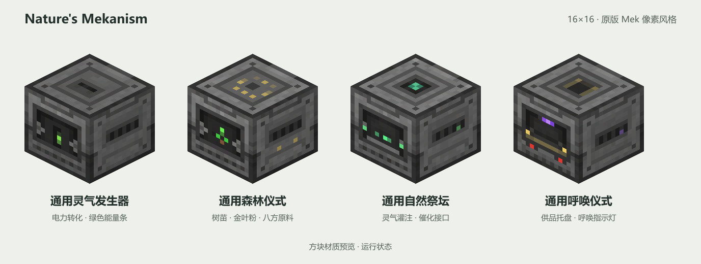

# 方块材质

这套材质以 Mekanism 原版机器的 **16×16** 像素尺度、灰黑机壳、内凹工作接口和简洁工业面板为参考。新增图案由内置 **image_gen** 生成，再进行机械分面与最近邻像素导出。

| 机器 | 识别特征 |
| --- | --- |
| 通用灵气发生器 | 细长绿色能量条、灰色电力触点 |
| 通用森林仪式 | 小树苗、金叶粉指示点、顶部八个原料位置 |
| 通用自然祭坛 | 灌注托盘、青绿色灵气与催化接口 |
| 通用呼唤仪式 | 供品托盘、少量金色和紫色指示像素 |

每台机器包括 `front.png`、`top.png`、`side.png`、`front_active.png`，均为真正的 16×16 PNG。侧面贴图同时用于背面与底面。运行时通过模型状态切换正面贴图，不额外加载高分辨率原稿。



原稿位于 `source/`，提示词与原版参考来源见 [prompts.json](prompts.json)。原稿中的四个区域依次为左上正面、右上顶部、左下侧面、右下工作正面。`texture-sheet.png` 是成品的像素放大检查图，四行依次对应上表，四列顺序与上述区域一致。

游戏实际使用的 PNG 位于 `../src/main/resources/assets/naturesmekanism/textures/block/<机器 ID>/`。本目录的原稿和预览不进入游戏 JAR。

需要重新导出时，在本目录安装 Node.js 开发依赖并运行：

```text
npm install
npm run export
```

导出工具只分面并以最近邻方式缩放，不重绘图案。更新模型和方块状态使用子项目根目录中的 `python tools/generate_resources.py`。

Mekanism 原版参考的 MIT 版权说明保存在 `../src/main/resources/META-INF/licenses/Mekanism.txt`。
