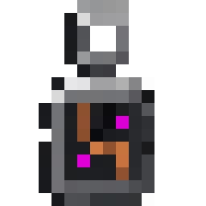
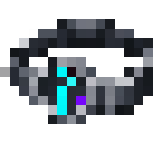

# 科技核心挂坠

用户要求物品具有饰品形态与科技风。采用带金属吊环的小型核心挂坠，暗灰金属外壳、铜触点、断裂线路和少量紫红状态灯。

- 工具：内置 ImageGen。
- 最终完整提示词：[prompt-v2.txt](prompt-v2.txt)。首稿较暗，第二稿突出银灰吊环、铜触点与故障灯。
- 最终原稿：[source/overloaded_short_circuit_core-v2.png](source/overloaded_short_circuit_core-v2.png)，保留生成的真实透明通道；首稿保留供设计记录。
- 导出：`tools/export_art.cjs`，仅去掉透明外沿、保持比例并填透明边距，通过 Sharp 最近邻缩为真正的 16×16 PNG，不抠图、不重画、不模糊。
- 游戏材质：`src/main/resources/assets/overloadcore/textures/item/overloaded_short_circuit_core.png`。
- 实体显示：Curios 的 PendantRenderer 把原物品模型贴合玩家躯干，在普通装备前方显示；不生成可放置的机器方块。

在 art 中安装依赖后运行 `npm run export`。图稿、提示与预览留在仓库，本体 JAR 只包含运行所需的小贴图和模型。

此图是资源预览，不代表已进行游戏内视觉验收。

## 逆命雷印

- 原创图稿通过内置 ImageGen 生成，原稿为 [source/thunder_ward.png](source/thunder_ward.png)，完整提示词见 [thunder-ward-prompt.txt](thunder-ward-prompt.txt)。
- 银灰科技腕环、青色电路与紫色触点；源文件含真正透明通道。沿用 `tools/export_art.cjs` 透明外沿裁切与最近邻缩放，输出 16×16 的 `textures/item/thunder_ward.png`。
- Curios 佩戴外观跟随右前臂，与胸前过载挂坠分开，避免两件饰品重叠。触发动画使用自己的物品图标。

空饰品栏位从 alpha.3 起直接引用 Curios 9.5.1 的 `curios:slot/empty_necklace_slot` 灰色吊坠图标，通过 Curios 自己的图集加载，不复制其材质。两个 ImageGen 自定义候选未输出真实透明通道，因此未用于游戏资源；不把棋盘格当作透明背景，也不改动挂坠物品本身的材质。
