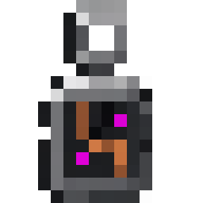
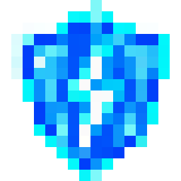
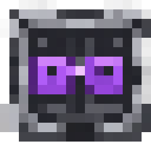

# 科技核心挂坠

用户要求物品具有饰品形态与科技风。采用带金属吊环的小型核心挂坠，暗灰金属外壳、铜触点、断裂线路和少量紫红状态灯。

- 工具：内置 ImageGen。
- 最终完整提示词：[prompt-v2.txt](prompt-v2.txt)。首稿较暗，第二稿突出银灰吊环、铜触点与故障灯。
- 最终原稿：[source/overloaded_short_circuit_core-v2.png](source/overloaded_short_circuit_core-v2.png)，保留生成的真实透明通道；首稿保留供设计记录。
- 导出：`tools/export_art.cjs`，仅去掉透明外沿、保持比例并填透明边距，通过 Sharp 最近邻缩为真正的 16×16 PNG，不抠图、不重画、不模糊。
- 游戏材质：`src/main/resources/assets/overloadcore/textures/item/overloaded_short_circuit_core.png`。
- 实体显示：Curios 的 PendantRenderer 把原物品模型贴合玩家躯干，在普通装备前方显示；不生成可放置的机器方块。

在 art 中安装依赖后运行 `npm run export`。图稿、提示与预览留在仓库，本体 JAR 只包含运行所需的小贴图和模型。

此图是资源预览，不代表已进行游戏内视觉验收。

## 逆命雷印

- alpha.14 按用户要求参考实际 Mek 装备：深灰底层、银灰分块护板、黑色凹槽、绿色能源纹路与白绿雷弧。内置 ImageGen 原稿为 [source/thunder_ward-mek-v5-raw.png](source/thunder_ward-mek-v5-raw.png)，完整提示词见 [thunder-ward-mek-prompt.txt](thunder-ward-mek-prompt.txt)。
- 原图为 1254×1254 RGB。沿用用户已授权的背景处理，`tools/prepare_ward_mek.cjs` 保护盾面中性深色轮廓与白绿雷弧，仅清理外围连通棋盘背景，不改 RGB；结果为 [source/thunder_ward-mek-v5.png](source/thunder_ward-mek-v5.png)。`tools/export_art.cjs` 保持比例并最近邻缩为实际 16×16 的 `textures/item/thunder_ward.png`。
- 参考取自实际依赖 `Mekanism-1.21.1-10.7.19.85.jar`：`assets/mekanism/textures/item/mekasuit_helmet.png`、`mekasuit_bodyarmor.png` 及对应 `_tint_layer.png`；`module_energy_unit.png`、`module_radiation_shielding_unit.png` 和 `energy_tablet.png`。另核对 MekaTool 使用 OBJ 模型及 `assets/mekanism/textures/entity/armor/mekatool.png` 图集，不把它误当作普通物品 PNG。
- ImageGen 输入包含旧雷印改图对象，以及 MekaSuit 胸甲、能量模块两个风格参考。上游贴图只在忽略的 `build/reference/ward-mek-style/` 用于观察，不复制进运行材质或发布包。
- 旧腕环、实体印章、蓝色能量盾及灰白雷盾原稿/提示词均保留为历史设计；对应旧背景处理脚本不参与当前导出。

当前完整导出流程：在模组目录依次运行 `node tools/prepare_ward_mek.cjs`、`node tools/export_art.cjs`。
- Curios 佩戴外观跟随右前臂，与胸前过载挂坠分开，避免两件饰品重叠。alpha.15 起取消保命时的居中弹出动画，物品栏、手持和佩戴继续共用此图标。

空饰品栏位从 alpha.3 起直接引用 Curios 9.5.1 的 `curios:slot/empty_necklace_slot` 灰色吊坠图标，通过 Curios 自己的图集加载，不复制其材质。两个 ImageGen 自定义候选未输出真实透明通道，因此未用于游戏资源；不把棋盘格当作透明背景，也不改动挂坠物品本身的材质。

## 余雷耦合单元

alpha.16 原创双线圈电路匣，参考原生 Mek 模块轮廓。使用内置 ImageGen 新生成，原稿为 [module_residual_coupling_unit.png](source/module_residual_coupling_unit.png)，完整提示词和参考记录见 [coupling-module-prompt.txt](coupling-module-prompt.txt)。原图具有真实透明通道；`tools/export_module_art.cjs` 仅透明边裁切与最近邻缩放为16×16，运行时不新增动态渲染器。

## alpha.17 装备与武器模型

新增模块、武器和MekaSuit外装为原创代码模型，由 `tools/generate_equipment.py` 生成，使用已有原创16px耦合模块配色，并通过模型顶点色添加少量绿色指示灯。没有另行绘制／改写位图，没有复制上游装备贴图。

- [模块实际资源预览](equipment-modules-preview.png)
- [武器静态回退预览](weapons-preview.png)
- `GearGlowMesh` 与 `.vsh/.fsh` 只覆盖武器能量面；所有机壳与能量面共同求外表面后拆分，消除覆盖面。
- `tools/preview_equipment.cjs` 用原PNG最近邻采样和深度缓存离线渲染，不代表游戏内验收。
- `tools/VerifyGearShader.java` 在隐藏GL上下文编译实际GLSL并核对动画、空电量变暗和遮挡；不启动Minecraft客户端。

## alpha.19 Mek 风格修订（当前）

- 模块使用 Mek 的原生 `mekanism:item/module_base` 作为模型底层，原创功能窗口作为第二层；只引用上游资源，不将上游PNG复制进JAR。
- 内置 ImageGen 原稿：[功能窗口图集](source/mek-module-panels-v2.png)、[装备材质图集](source/mek-equipment-materials-v2.png)。完整提示词和工具记录：[mek-gear-v2-prompts.json](mek-gear-v2-prompts.json)。
- `tools/export_mek_gear.cjs` 按4×3切窗口、中央70%×75%裁切、nearest到8×6并填透明边到16×16；装备材质2×2分面后nearest到16×16。没有脚本重绘图案、抠背景或模糊。
- [模块联系表](mek-module-icons-v2.png)使用忽略目录中的原版基板作离线合成参考。武器和MekaSuit外装改用gear_alloy／gear_graphite／gear_grip／gear_circuit，缩小发光槽，统一绿色shader和静态回退。

### alpha.20 武器握持与效果

沿用 alpha.19 的 16px PNG，不重绘纹理。`GearPose` 维护第一人称握把与蓄力变换；`generate_equipment.py` 维护左右手模型显示参数。`VerifyGearPoses.java` 导出实际矩阵，`preview_weapon_poses.cjs` 离线渲染到 `build/weapon-visual-check/first-person.png` 和 `third-person.png`。第三人称蓝灰人体仅为握把校准参照，不进入游戏。

`gear_field.vsh/.fsh` 与 `GearEffectGeometry` 绘制短曳光、刃场、蓄力约束环和电弧。`VerifyGearShader.java` 在隐藏 OpenGL 上下文中检查实际几何、时间变化、透明混合和深度遮挡，输出到 `build/gear-shader-check/`；不启动 Minecraft 客户端。
- 过载核心原稿与运行贴图未改。alpha.17的紫色立体模块预览为历史设计，当前模块已换成原版尺寸的平面插针板图标。
