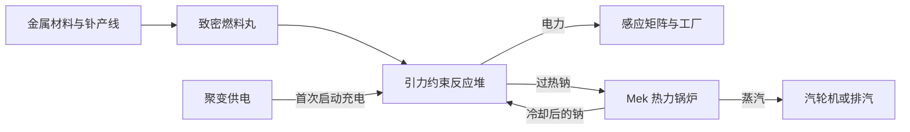

# 引力约束反应堆 · 后期多方块发电方案

日期：2026-09-21。状态：结构与视觉方案已落实为 [MekGravity 原型](../MekGravity/README.md)。本文保留设计背景，实际行为与安装步骤以原型 README 为准。下文尚未落实的超载等条目仍是后续提案。

[结构与视觉设计包](gravity-reactor/README.md) · [交互看板](gravity-reactor/design-board.html) · [七层搭建图](gravity-reactor/layers.svg)

## 最新修订

alpha.2按用户反馈取消强制钠冷却；默认功率与燃料能值提高4倍，单口16 GFE/t，缓存输出不再受发电功率限制。玻璃连接、成型皮肤和核心特效已经接入。下面保留最初设计背景，当前安装与玩法以MekGravity/README.md为准。

## 定位与参考

接在 Mek 聚变供电和 SPS 之后，为高并行工厂、大规模合成提供集中电源。推荐名称为“引力约束反应堆”，简称“引力堆”。核心玩法是建立约束场、供给致密物质、处理冷却回路和调节负载。

科幻灵感采用《星际迷航》中罗慕兰战鸟的奇点能源核心；Star Trek 官方介绍确认该舰使用 Singularity Warp Core。这里只借用“受控奇点作为能源核心”的设定，燃料、外观和玩法自行设计，不复制作品模型或标识。[官方介绍](https://www.startrek.com/en-un/news/sto-guest-blog-warbird-singularity-powers)

Mek 官方 Wiki 将持续满供 D-T 燃料聚变的直接发电描述为约 200 MFE/t。该数值用于量级比较，实际取决于版本、配置、供料、热量和外部设备。[聚变堆说明](https://wiki.aidancbrady.com/wiki/Fusion_Reactor)

当前仓库实际发布依赖为 Mekanism 1.21.1-10.7.19.85。核对该发布件后确认：聚变默认每单位燃料供热 10,000,000 J、直接热电转换系数 0.05；SPS 默认每单位钋耗电 1,000,000 J，每 1,000 单位钋产出 1 单位反物质。数值不是无条件的 FE 发电实测，FE/J 换算仍按 Mek 配置。开发参考：[聚变配置](https://github.com/mekanism/Mekanism/blob/1.21.x/src/generators/java/mekanism/generators/common/config/GeneratorsConfig.java)、[SPS 配置](https://github.com/mekanism/Mekanism/blob/1.21.x/src/main/java/mekanism/common/config/GeneralConfig.java)。链接分支会更新，实施时继续以选定发布件为准。

反物质用于制作引力核心及高阶线圈，形成明确的 SPS 后置门槛。稳定运行另用持续消耗的物质燃料，不采用“反物质返还为更多反物质”的奖励，也不要求按现实物理模拟奇点。

## 结构与外观

首版固定 **7×7×7**，不同时开发多种尺寸。后期提升功率主要通过更换内部组件完成。

- 中心为一个引力核心，六个方向各放一组约束线圈，朝向中心。
- 以 0～6 为各轴坐标，核心位于 (3,3,3)，六个线圈位于各轴的 1/5 位置，另两轴为 3。线圈与核心间留出一格通道，其余内腔留空。
- 棱角使用反应堆框架，面板可放外壳、反应堆玻璃和各类接口；控制器仅一个。
- 最低运行接口：一个燃料仓、两个分别配置为进/出的冷却口、一个励磁输入口、一个发电输出口。高负载可增加同类接口。
- 框架和普通外壳任意位置右键打开主看板；燃料仓直接打开自己的库存。冷却、电力端口显示对应配置，权限统一归主控。
- 提供结构预览和缺件定位，生存一键搭建实际扣料；不靠试错猜线圈位置。

视觉采用 Mek 后期设备的浅灰装甲、深色内凹接口、厚框玻璃和少量紫色/青白指示灯。核心为小型暗球，外围一圈细亮的吸积环；六个线圈有朝向明确的发射口。外部大部分面积保持工业材质，工作时改变指示灯和内腔效果，不让整座外壳变成发光方块。

运行时贴图仍是 16×16。首轮已生成原创整机剖视概念，另有精确七层布局与主控/燃料仓界面草图；尚未制作运行时纹理。概念图省略部分玻璃和顶盖展示内腔，实际搭建以封闭分层图为准。

## 供料与运行

推荐流程：

燃料丸的候选配方为锇块、铅块、精炼黑曜石块及钋球组合加工。先控制新增中间物数量，优先使用工作台或已支持的 Mek 加工类型，允许普通自动合成与现有并行工厂生产；具体配比在原型阶段结合产线成本确定。

燃料由数据配方声明输入、数量、可用能量及必要残余物，支持数据包和 JEI。不会按物品名字、稀有度或随意一个物品的堆叠数量推算发电量。首版提供一种通用燃料，不要求玩家为四级线圈维护四条不同燃料线。

首版启动过程：检查结构与冷却 → 外部电源充能 → 建立约束场 → 逐渐提高供料。稳定后从自身产能维持约束场，默认目标为额定电功率的 2% 自耗。引力核心是耐用部件，正常启停不消耗新的反物质核心。

每颗燃料转换为有限的反应余量，按实际推进扣除。整颗进入后即使停机，也保留尚未反应的余量；不能为了显示连续消耗而每 tick 吞掉一颗，也不能暂停后重新算成满颗。

采用 Mek 钠/过热钠与热力锅炉组成闭路冷却。冷却不足限制允许功率；热钠出口堵塞自动降载。钠量、热量和汽轮机回收必须按当前 Mek 冷却物性核算，避免巨量冷却需求迫使玩家复制几十套相同锅炉。

燃料的能量预算必须同时覆盖直接发电、约束场自耗和冷却带走的可回收热量。钠流量和单丸总能值暂不锁定；不能把已经计入全部电收益的同一份热量再完整送给锅炉发一次电。

## 功率初值

以下为正常模式的**毛发电上限提案**，不包含启动充能，净供电需扣除约束场自耗；也不意味着尚未验证的冷却或线缆能自动满供。

| 线圈等级 | 毛发电上限 | 扣除 2% 自耗后的目标上限 | 满功率所需输出口 |
| --- | ---: | ---: | ---: |
| 初级 | 500 MFE/t | 490 MFE/t | 1 |
| 高级 | 1 GFE/t | 980 MFE/t | 1 |
| 精英 | 2 GFE/t | 1.96 GFE/t | 2 |
| 终极 | 4 GFE/t | 3.92 GFE/t | 4 |

1 GFE/t = 1,000,000,000 FE/t。六组线圈中的最低等级决定允许功率；更换一组高级线圈不会把整堆直接升到最高档。升级提高每 tick 可处理的燃料量，不凭空提高每颗燃料的能值。将线圈升级与原料吞吐、散热、外部输电一起作为后期扩展目标。

候选启动充能为 64 GFE，总量计入启动消耗；候选运行电缓存为 1 TFE。启动充能速度取决于实际供电，不强制玩家等待固定倒计时。后续需要对照聚变/SPS 实际投入检查启动门槛和回本时间，避免“刚解锁就开不起”和“一点燃就无成本无限供电”。

正常模式提供目标负载设置，默认根据电缓存自动调节：电满逐渐降低供料，长时间无需求进入待机；补料与恢复接收后自动升载。备用电留给约束和安全停机，不能从普通输出口抽干。

不采用装满普通速度升级后指数增加大发电量的机制。第一版先做好线圈等级与负载调节，稳定度、保温或响应模块作为后续候选。

## 输出与后期联动

- 发电口候选上限 1 GFE/t，增加端口扩大出口总量，但所有端口共享同一实际储能和全堆预算，不能按端口复制产能。
- 优先使用 Mek 的 long 能量接口，兼容 FE。FE 单次操作使用 int，不能把全堆 4 GFE/t 强转为 int；通过多个端口、受限分批操作桥接，按实际接收量扣能量。[Mek 能量接口](https://github.com/mekanism/Mekanism/blob/1.21.x/src/api/java/mekanism/api/energy/IStrictEnergyHandler.java)
- 支持直接连接相邻感应矩阵端口；矩阵仍受其自身供应器合计吞吐限制。当前发布件终极供应器默认为 131,072,000 J/t，不能声称一个原版供应器能接满整个引力堆。
- 原通用线缆按实际网络容量与接口运行，不修改其全局倍率。Extras 高阶线缆、元件、供应器通过实际能力接入，并在原型阶段用真实物流验证；不以“已注册能力”代替满载供电测试。
- 主看板同时显示“毛发电 / 自耗 / 实际输出”，输出受限时提示“外部储能或输电能力不足”，不能只显示漂亮的额定功率。
- 基础功能不要求安装 MekFactory 或 Extras。电力可直接供给现有工厂。是否拆成独立附属及发布依赖，在进入实现时确定。

## 故障与操作

主界面只保留燃料余量、净供电、冷却、约束稳定度、目标负载，以及启动/停机；精确热量、端口分摊、运行记录放进侧栏。沿用 Mek 原生控件、升级/红石/安全习惯，不做单独的大型科幻仪表盘。

正常模式默认保护：缺燃料逐渐停机；缺冷却、出口堵塞或稳定度过低先降载，无法恢复则安全停机。预留冷却与约束余量，不能等到下一次点火时才告诉玩家故障原因。

结构被拆、区块卸载或服务器重启立即停止世界推进，保留物料、能量、温度和在制余量；不补算离线发电，也不模拟离线事故。未加载区块不查询、不强制加载。

可选超载模式作为第二阶段：最大约 125% 功率，但单位电量燃料消耗和冷却压力更高。需要明确开启。保护动作可损失当前反应中的少量燃料并造成停机，不默认破坏玩家基地；大范围爆炸、吞方块和随机死机不列入首版。

持续高温、强辐射与附近玩家伤害不作为首版常驻惩罚。若未来加入危险模式，应能由防护、距离和联锁明确控制，不用每隔一段时间靠手工修理维持自动化。

## 原型验收顺序

1. 先实现一种固定 7×7×7 结构、预览和准确故障定位，完成燃料、冷却、启动电、对外供电的真实接口。
2. 用有限燃料验证总能量预算、热钠数量、暂停余量和多端口守恒，再标定功率与燃料配比。
3. 真实连接原感应矩阵、并行工厂和可选 Extras 输电；缺电、满电、缺冷却、补料、拆装、卸载重载均应正常恢复。
4. 开放四级线圈并验证最低等级规则；主界面始终显示实际产出。
5. 完成原创 Mek 风格材质及简洁内腔效果。客户端视觉验收由用户进行，不自行启动游戏。

已实现的首版包含固定结构、四级线圈、资源接口、搭建与保护停机；超载和额外专用升级尚未加入。
